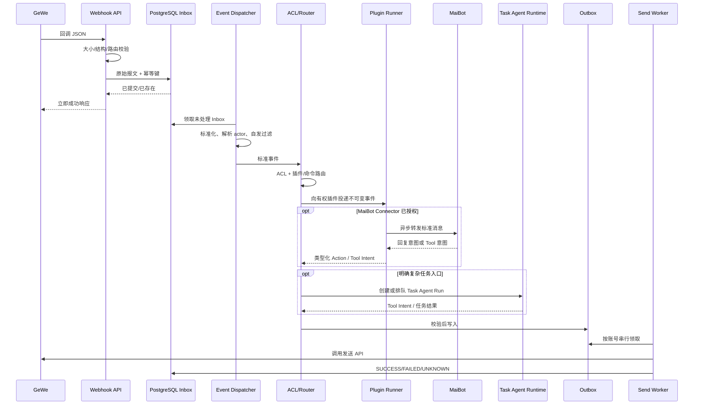
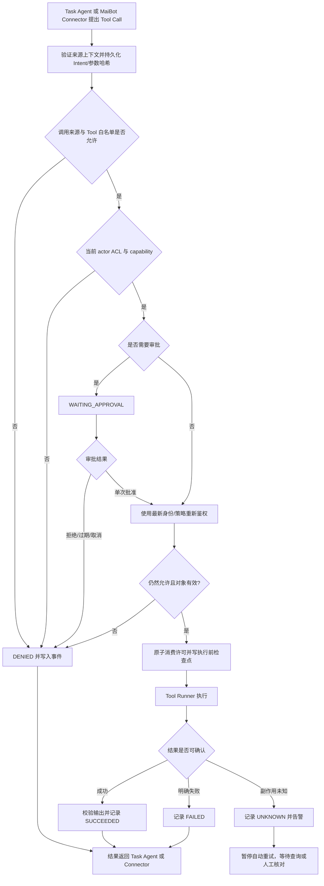
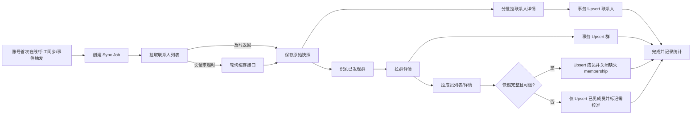
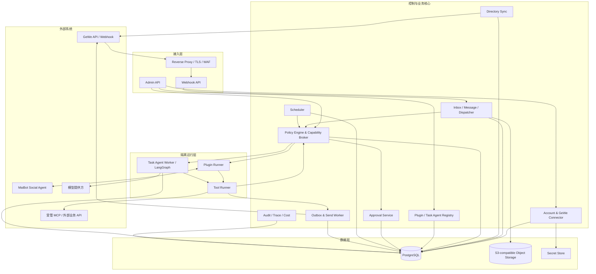
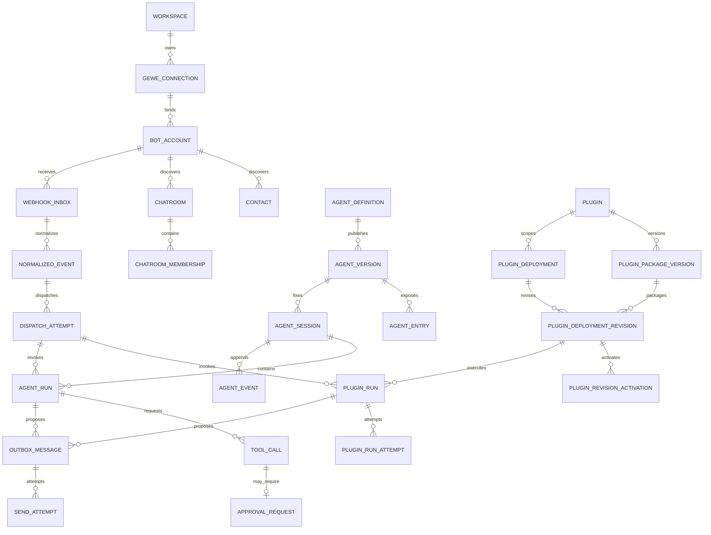
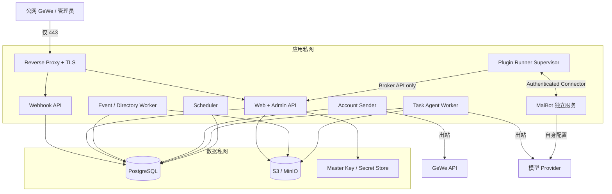

# 微信机器人管理与 Agent 平台

## 项目需求与总体设计说明书

| 文档项 | 内容 |
| --- | --- |
| 文档版本 | `v0.3.2` |
| 文档状态 | 实施基线；已授权本地开发，外部联调与生产上线待验收 |
| 编制日期 | 2026-08-30 |
| 项目性质 | 单组织私有部署；MVP 强制单工作区，后续可演进为多工作区 |
| 上游微信能力 | GeWe V2 API 与 Webhook |
| 默认技术方向 | Python 模块化核心、独立插件运行时、独立 MaiBot、LangGraph Task Agent Runtime |
| 进度事实入口 | [《当前实现状态与验收边界》](./当前实现状态与验收边界.md) |

> 本文档是产品设计、技术实现、测试和验收的共同基线。项目已经进入本地开发、测试和构建阶段；未在本文档或后续变更记录中确认的功能不自动进入范围。生产部署、正式账号、真实外部数据和高风险操作仍需甲方另行授权。

本版根据 2026-08-30 与甲方的需求沟通完成以下边界调整：

- MaiBot 独立运行并视为黑盒；其拟人、人格、记忆、学习、主动聊天和内部数据不由本系统实现或管理。
- `MaiBot Connector` 作为本系统插件接入，和其他插件一样接受账号、群、群成员、命令/Tool ACL、Capability、审计和热拔插管理。
- MaiBot 是否参与普通群聊由其内部逻辑决定，不以被 `@` 为前提；本系统只决定消息是否允许转发以及回复是否允许发送。
- `MaiBot Tool Bridge` 允许 MaiBot 请求本系统插件 Tool，平台按真实来源身份再次鉴权；MVP 先开放低风险只读 Tool。
- 本系统 Agent 明确为“复杂任务执行器”，负责持久任务、多步骤 Tool、审批和失败恢复，不承担拟人群聊和社交记忆。
- GeWe 回调默认由甲方在 GeWe 后台手动管理；平台展示回调地址、接收验证并监控健康，但不自动覆盖，平台代管仅在管理员明确操作后启用。
- 开发可在需要时访问 GeWe 官网最新 API 文档；仓库快照用于审计，官网用于核对变化，真实测试报文与契约测试用于确认实际行为。

---

## 1. 文档目的与评审方式

### 1.1 文档目的

本文档用于让甲方和实施方持续确认以下内容：

1. 系统最终要解决什么问题，以及首版必须交付什么。
2. GeWe、微信机器人核心、插件系统、权限系统和 Agent 系统之间的职责边界。
3. 哪些能力进入 MVP、V1、V2，哪些能力首期明确不做。
4. 数据、安全、可靠性、部署、测试和验收要求。
5. 仍需甲方决定的业务规则和风险偏好。

### 1.2 需求优先级

| 标记 | 含义 |
| --- | --- |
| P0 | 对应功能开发前必须完成的关键第三方契约验证，分为 P0-MVP 与 P0-V1 |
| MVP | 第一个可投入真实测试群使用的完整版本，必须交付 |
| V1 | 首个稳定生产版本，在 MVP 基础上补齐运营和可靠性能力 |
| V2 | 高级 Agent、生态和规模化能力 |
| 暂不做 | 当前明确排除，后续只能通过变更评审加入 |

### 1.3 当前治理结论

- [x] 项目定位为 GeWe 之上的私有微信机器人管理与 Agent 平台。
- [x] MaiBot 独立运行，本系统只通过 Connector 和受控 Tool 边界接入。
- [x] 插件、Agent 和外发动作由平台 ACL、capability、Outbox 与审计统一约束。
- [x] GeWe 回调默认由甲方手动配置，平台代管只能由管理员显式启用和应用。
- [x] 已授权进入本地开发、自动化测试和构建。
- [ ] 真实 GeWe、MaiBot、模型 Provider、公网回调和生产 PostgreSQL 联调仍待对应资源与授权。
- [ ] 生产部署、正式微信账号和高风险群操作仍待单独批准。

### 1.4 当前实现快照

截至 2026-08-30，项目处于本地开发版本阶段，尚未达到生产上线条件：

| 领域 | 当前事实 |
| --- | --- |
| M1 工程与安全底座 | FastAPI、Vue 3、Alembic、认证、CSRF、RBAC、加密凭据和管理后台已实现 |
| M2 微信核心 | Connection、账号、Webhook、目录、消息 Trace、Outbox/Sender 已形成本地契约链路；真实 GeWe 待验收 |
| M3 插件与 ACL | 内置插件、独立 Runner、Deployment/Revision、热启停/回滚、群/成员 ACL 已实现 |
| MaiBot Connector | WebSocket、ACK、重连、TTL、幂等、fencing、回复及主动消息权限已实现；真实 MaiBot 和 Tool Bridge 待完成 |
| Task Agent | Definition/Version/Session/Run/Inbox/Event/Question、管理 API、独立 RBAC、管理员身份/代答审计和后台工作台已实现；模型 Worker、Tool Broker、通用审批、预算和外部入口待完成 |
| 交付级别 | 当前属于本地开发版本；没有真实第三方和生产 PostgreSQL 证据时不得标记为生产可用 |

逐项证据、安装方式、验收清单和已知限制以[《当前实现状态与验收边界》](./当前实现状态与验收边界.md)为准。

---

## 2. 项目背景与产品定位

### 2.1 项目背景

GeWe 提供微信登录、消息收发、联系人、微信群和群成员等第三方 API。本项目在 GeWe 之上建设一套由甲方完全掌控的微信机器人管理平台，解决以下问题：

- 集中管理多个 GeWe Token 和微信账号。
- 持久化联系人、已发现群和群成员，形成可查询、可审计的本地数据视图。
- 通过插件快速扩展确定性的业务功能。
- 将插件权限精确配置到账号、群、群成员和命令级别。
- 通过独立 MaiBot 提供拟人群聊，并以受控 Connector 纳入统一插件权限。
- 提供类似 DeepSeek Harness 的复杂任务执行能力，让 AI 可以在受控 Tool、审批、检查点和预算范围内完成多步骤任务。
- 对消息、插件、Agent、外发动作和权限变更进行全链路追踪。

### 2.2 产品定位

本项目定位为：

> 一个面向私有部署的微信机器人管理与 Agent 平台。GeWe 负责连接微信，本系统负责账号管理、数据持久化、消息可靠性、插件、权限、Agent、审计和运营工作台。

它不是 GeWe 的简单 API 面板，也不是把现有聊天机器人框架换一个界面。系统的核心价值是将微信身份、业务插件和 Agent 自主行为置于统一、可解释、可审计的控制层中。

本项目不重做 MaiBot。MaiBot 是可替换的外部拟人服务；本系统只通过 Connector 插件控制它能接收哪些微信消息、能提出哪些回复和 Tool 请求，以及这些动作最终能否执行。

### 2.3 默认建设假设

在甲方未另行确认前，按以下假设设计：

- 单组织私有部署，不提供公共 SaaS 注册与计费。
- 首期支持约 1 至 20 个微信账号，架构可平滑扩展。
- 机器人主要服务于私聊、微信群和后台运营场景。
- 生产环境部署在 Linux 服务器，Windows 用于本地开发。
- 首期插件为甲方或项目方审核过的私有插件，不开放公共市场。
- 首期 Agent 使用 DeepSeek 或其他 OpenAI-compatible 模型，模型提供方可配置。
- 已启用 `MaiBot Connector` 的账号、群和成员消息可在通过 ACL 后转发给 MaiBot；MaiBot 自行决定何时参与聊天，被 `@` 不是前提条件。
- 平台复杂任务执行器只通过后台操作、明确命令、MaiBot Tool Bridge 或自动化显式启动，不作为普通群聊的拟人主响应者。
- 拉人、踢人、批量发送、修改群管理和修改权限等高风险动作默认关闭或要求人工审批。

### 2.4 成功指标

| 指标 | 目标 |
| --- | --- |
| 新账号接入 | 管理员可完成 Token 配置、扫码登录、在线确认和首次同步 |
| Webhook 接收 | `p99 < 1 秒` 完成持久化并响应，硬上限低于 GeWe 的 3 秒要求 |
| 入站幂等 | 相同 `appid + newMsgId` 重放只产生一次业务副作用 |
| 权限准确性 | 群、成员、插件、命令和 Agent 的允许/拒绝/继承均有自动化测试 |
| 插件隔离 | 单个插件崩溃、超时或返回非法动作不影响 Webhook 和其他插件 |
| Agent 可控性 | 每次工具调用可追踪，高风险动作可暂停审批，服务重启后可恢复 |
| Connector 权限 | 未授权账号、群或成员的消息不会转发给 MaiBot；MaiBot 回复和 Tool 请求均需再次授权 |
| 运维可见性 | 可从一条微信消息追踪到权限、插件/Agent、Outbox 和最终发送结果 |

---

## 3. 术语与核心概念

| 概念 | 定义 |
| --- | --- |
| GeWe Connection | 一个 GeWe Token 及其回调、API 地址和密钥配置，一个 Token 可关联多个微信账号 |
| Bot Account | 一个通过 GeWe 登录的微信账号，以 `appId + wxid` 标识 |
| 已发现群 | 通讯录同步或 Webhook 消息中出现过、已被系统发现的群，不代表微信中的全部历史群 |
| Principal | 可被授权的身份，包括后台用户、微信联系人、群成员、Task Agent、Connector service principal 和系统任务 |
| Plugin | 版本化扩展单元，可以提供确定性事件/命令/Tool，也可以作为 Connector 与外部服务通信 |
| Tool | Agent 或插件调用系统能力的受控接口，具有输入输出 Schema 和 capability |
| Skill | 按需加载的版本化说明、流程和领域知识，默认不执行代码 |
| Social Agent Provider | 负责拟人对话的外部服务；MVP 的首个 Provider 为独立运行的 MaiBot |
| MaiBot Connector | 本系统中的长连接插件，负责按 ACL 向 MaiBot 转发消息、接收回复和维护连接状态 |
| MaiBot Tool Bridge | MaiBot 与本系统 Tool Broker 之间的受控调用通道，不授予 MaiBot 直接执行插件或调用 GeWe 的能力 |
| Task Agent | 具有模型、任务会话、Tool、Skill、预算和运行策略的复杂任务执行器，不负责拟人群聊 |
| Agent | 本文未特别说明时均指 Task Agent |
| Agent Definition | Task Agent 的可编辑定义，如模型、任务规则、Tool、Skill 和预算策略 |
| Agent Version | Agent Definition 发布后的不可变版本，已有会话固定使用其创建时版本 |
| Agent Entry | 后台、明确命令、MaiBot Tool Bridge 或自动化与 Agent Version 的任务入口关系 |
| Task Session | 由请求身份、Task Agent Version 和任务作用域共同隔离的持久执行上下文 |
| Agent Run | Agent 针对一次输入或任务的具体执行，包含多个模型步骤与工具调用 |
| Automation | 由时间、消息、系统事件或后台操作触发的插件或 Agent 任务 |
| Capability | 对具体系统动作的机器可执行授权，如发文字、读成员、踢人、联网和创建任务 |
| Inbox / Outbox | 持久化入站事件与外发动作的可靠性边界 |
| UNKNOWN | 外部请求超时且无法判断副作用是否已发生的状态，不允许盲目自动重试 |

### 3.1 Plugin、Tool、Skill 与 Agent 的关系

- Plugin 提供确定性的业务逻辑，也可以向 Agent 注册 Tool。
- Tool 是唯一允许 Agent 触发系统副作用的接口。
- Skill 向 Agent 提供任务说明和领域流程，不等同于可执行插件。
- Agent 根据上下文和模型决策调用 Tool，但不能直接访问 GeWe Token、核心数据库或宿主系统。
- Plugin 和 Agent 的所有微信外发动作都必须经过 Capability Broker、Outbox 和账号级发送队列。
- MaiBot Connector 属于 Plugin；MaiBot 本体不是本系统插件进程，也不进入本系统 Agent Runtime。
- MaiBot 通过 Tool Bridge 提出的调用和 Task Agent 提出的 Tool Call 进入同一 Tool Broker，执行端不信任上游已经完成的权限判断。

---

## 4. 参考项目与设计依据

本项目只借鉴下列项目的成熟设计，不直接复制其业务代码。具体依赖在开发时单独核对许可证、版本和安全边界。

| 参考项目 | 借鉴内容 | 不直接照搬的原因 |
| --- | --- | --- |
| [DeepSeek Harness](https://github.com/deepseek-ai/deepseek-harness) | 插件化能力、追加式会话事件、Tool 流水线、一次性审批、Skills、计划、Schedule、Subagent、Token 计量和 Trace | 当前官方仍标注 developer preview，存在破坏性变更且未经安全审计；其本地文件、Shell 和编码工作区不适合作为生产微信权限边界 |
| [LangGraph](https://docs.langchain.com/oss/python/langgraph/overview) | 长任务持久化、流式事件、Human-in-the-loop、检查点、恢复和状态图 | 仅作为 Agent 执行引擎，业务权限、消息可靠性和管理后台仍由本项目实现 |
| [AstrBot](https://docs.astrbot.app/) | Agent 与插件结合、事件过滤、优先级、传播终止、Schema 配置和 Trace | 原生权限较粗，不能替代群/群成员 × 插件/命令 ACL；平台插件不能直接证明 GeWe 兼容 |
| [LangBot](https://docs.langbot.app/) | 插件独立进程、Plugin Runtime、资源限制、异常熔断、Pipeline 和监控 | Workspace/Pipeline 权限不能替代微信群成员级 ACL；进程隔离不等于 capability 隔离 |
| [NoneBot2](https://nonebot.dev/) | Adapter、Event、Matcher、Rule、Permission、Priority、Block 的清晰事件链 | 插件通常与核心同进程，缺少本项目需要的中央持久 ACL 和安全隔离 |
| [Koishi](https://koishi.chat/) | 可逆插件生命周期、作用域过滤、Schema 驱动配置、控制台和版本管理 | Node.js 进程内插件不适合作为不可信代码隔离；Guild/Channel 不能原样映射微信群 |
| [Dify](https://docs.dify.ai/) | Agent Definition/Run 分离、草稿发布、Human Input、调度、Trace、插件 Manifest 和签名 | 它不负责 GeWe 契约、微信通讯录与发送可靠性，完整工作流画布对首版过重 |
| [MaiBot](https://github.com/Mai-with-u/MaiBot) | 拟人群聊、主动参与、人格、记忆，以及通过 `maim_message` WebSocket 连接外部平台 | 作为独立黑盒接入；不复制其人格/记忆实现，不让其替代本系统 ACL、Outbox、审计和插件权限 |

### 4.1 对 DeepSeek Harness 的采用边界

本轮调研基线固定为 DeepSeek Harness [`0.1.2-alpha.1`](https://github.com/deepseek-ai/deepseek-harness/tree/cd5ef8148158c3a752a658978873241fdf8e2bbc)、Commit `cd5ef8148158c3a752a658978873241fdf8e2bbc`。截至 2026-08-30，官方仍将其标记为 developer preview，并在 [Safety](https://github.com/deepseek-ai/deepseek-harness/blob/cd5ef8148158c3a752a658978873241fdf8e2bbc/SAFETY.zh.md) 中提示尚未完成安全审计，因此本项目只借鉴领域模型和运行原则。

本项目中的“类似 DeepSeek Harness 的 Agent”指以下产品能力：

- 持久会话、运行状态和事件日志。
- 类型化 Tool、执行前权限、人工审批、执行后审计。
- Agent Definition、不可变版本、模型配置和预算。
- Skills、计划、目标、定时任务和可观测运行轨迹。
- 后续可扩展的一次性 Subagent 和 Agent Team。

它不表示直接嵌入 DeepSeek Harness，也不承诺首版支持任意 Shell、浏览器、宿主文件系统、任意代码执行、完整 MCP 协议或实验性的 Agent Teams。

### 4.2 对 MaiBot 的采用边界

MVP 以固定兼容版本的 MaiBot 作为首个 Social Agent Provider。MaiBot 使用官方外部适配器方向，通过受认证 WebSocket 与 `MaiBot Connector` 通信；本系统不导入 MaiBot 内部 Python Runtime，也不 Fork MaiBot 作为项目底座。

职责边界如下：

- MaiBot 负责拟人、人格、记忆、学习、主动聊天、内部模型与自身数据。
- 本系统负责 Connector 插件生命周期、消息转发 ACL、回复 Action 校验、Tool Bridge、Outbox、限速和审计。
- 本系统不读取、修改、导出、纠正、删除或备份 MaiBot 内部记忆；这些能力和数据责任属于 MaiBot 部署本身。
- MaiBot 不持有 GeWe Token、核心数据库连接或插件 Runner 凭据，不能直接发送微信或直接执行本系统插件。
- Connector 停用、撤权或连接异常后立即停止新消息转发；MaiBot 不可用不得影响普通命令插件、Webhook、目录同步和发送队列。
- MaiBot 主程序为 GPL-3.0，另有其项目 EULA；固定版本、部署方式、署名与商业使用条件在正式交付前单独核对。本项目通过独立服务协议接入不等于自动免除相关义务。

### 4.3 GeWe 文档使用与更新规则

- 甲方提供的 `docs/gewe-api` 是开发机上的离线参考快照；其中含第三方公开的凭据样例，因此原始文件不进入 Git，也不作为可随代码版本审计的证据。
- 开发具体 API、遇到字段歧义、错误码变化、文档缺项或真实联调异常时，可以直接访问 [GeWe 官方 API 文档](https://doc.geweapi.com/) 核对最新说明。
- 使用官网资料形成实现决策时，版本库中的契约记录必须写明页面 URL、访问时间、页面标注更新时间和与本机快照的关键差异；需要长期依赖的变化应形成脱敏 Fixture 或差异记录。
- 官网文档与本机快照冲突时，不静默选择任一版本继续开发；先更新对应设计、Schema、脱敏 Fixture 和测试，再进入实现或兼容分支。
- 官网说明只能证明“文档当前这样描述”，不能代替第 17.2 节的真实 Token、真实报文和端到端契约验证。

---

## 5. 项目范围与边界

### 5.1 MVP 范围

- GeWe Token、微信账号扫码登录、在线检测、掉线状态和重连入口。
- Webhook 快速持久化、v1/v2 归一化、去重、自发消息过滤和消息中心。
- 联系人、已发现群、群成员、成员状态和同步任务持久化。
- 文本私聊、群聊、`@`、引用文本和账号级串行发送队列。
- 私有插件包、安装、配置、启停、运行日志、超时和进程级故障隔离。
- 插件安装、启用、停用、升级、回滚和卸载不重启主系统；在途 Run 先排空或按策略取消。
- 后台 RBAC、插件运行 ACL 和 capability 三层权限。
- 账号、群、成员、插件、命令和 Agent 的允许、拒绝、继承与有效期。
- 独立 MaiBot、`MaiBot Connector`、连接健康、普通群消息受权转发和回复 Action 回传。
- `MaiBot Tool Bridge` 调用平台低风险只读 Tool，并按来源账号、群、成员和插件权限二次鉴权。
- 单 Task Agent 定义、版本、任务会话、工具调用、持久 Run、一次性审批和基础成本统计。
- 受信任内置 Skill 的版本化绑定、按需加载和权限不可扩张约束。
- Task Agent 后台工作台，以及通过明确命令或 MaiBot Tool Bridge 发起任务的入口。
- 人工接管、接管期间积压消息处置和受控恢复 Connector/自动回复。
- 全链路审计、基础告警、死信查看和人工重试。
- 基础数据库备份、恢复脚本和隔离环境恢复验证。

### 5.2 V1 范围

- 图片、文件、语音、视频和引用消息的标准化与收发。
- 插件测试群灰度、签名信任库、资源配额和更强隔离。
- Task Agent 知识库、完整 Skills 安装/发布管理、固定间隔/Cron 自动化。
- 多模型提供方、主备模型、预算、限额和失败降级。
- 一次性 Subagent、结构化输出、Agent 评测用例和 Shadow 模式。
- 完整监控、增量备份与备份告警、数据导出/删除和账号健康中心。

### 5.3 V2 范围

- 可继续 Subagent、持久 Agent Team、任务 DAG、Mailbox 和共享产物。
- 受管 MCP Server、远程 Tool、复杂工作流编排。
- 自然语言生成插件的“插件开发 Agent”，支持隔离工作区、代码 Diff、测试、打包和人工发布。
- 私有插件市场、自动兼容检查和审核流程。
- 多工作区高级隔离和可选的多组织能力。

### 5.4 当前明确不做

- 公共多租户 SaaS、在线注册、套餐、账单和商业结算。
- 朋友圈、视频号和批量营销自动化。
- 自动批量加好友、无节制群发、绕过微信风控的功能。
- 普通 Task Agent 直接使用宿主 Shell、浏览器或任意文件系统。
- 未经审批的拉人、踢人、改管理员、解散群和跨群批量发送。
- 首版公开插件市场、跨语言插件运行时和完整可视化工作流画布。
- 本系统自建或接管 MaiBot 的人格、拟人决策、记忆、群友画像、内部模型配置和内部管理后台。
- 将 MaiBot 源码直接嵌入主程序，或允许 MaiBot 绕过 Connector 直接调用 GeWe 和本系统插件。

---

## 6. 用户角色与权限主体

### 6.1 后台角色

| 角色 | 默认职责 |
| --- | --- |
| Owner | 系统所有者，管理组织、密钥、全局安全策略和其他管理员 |
| Admin | 管理微信账号、插件、Agent、权限和系统配置 |
| Operator | 查看消息与目录、处理审批、运行已授权任务、人工接管会话 |
| Developer | 上传和调试插件、查看插件日志，不默认获得生产启用权 |
| Auditor | 只读查看权限、审计、运行轨迹、成本和安全事件 |
| Viewer | 只读查看被授权的数据页面 |

首期后台权限使用稳定机器 ID，默认映射如下；`scope` 表示仅限被分配资源，`test` 表示只允许非生产 Dry-run：

| 权限 ID | Owner | Admin | Operator | Developer | Auditor | Viewer |
| --- | --- | --- | --- | --- | --- | --- |
| `admin.user.manage` | 允许 | scope | - | - | - | - |
| `connection/account.manage` | 允许 | 允许 | 读 | - | 读 | 读 |
| `directory.read` | 允许 | 允许 | scope | test | scope | scope |
| `message.read` | 允许 | 允许 | scope | test | 脱敏 | scope/脱敏 |
| `message.send` | 允许 | scope | scope | test | - | - |
| `plugin.upload/test` | 允许 | 允许 | 读 | 允许 | 读 | 读 |
| `plugin.deploy.production` | 允许 | 允许 | - | - | 读 | 读 |
| `acl.manage` | 允许 | 允许 | - | - | 读 | 读 |
| `agent.edit/test` | 允许 | 允许 | test | 允许 | 读 | 读 |
| `agent.publish` | 允许 | 允许 | - | - | 读 | 读 |
| `approval.decide` | 允许 | 按风险 | 分配项 | - | - | - |
| `audit.read` | 允许 | 允许 | scope | test | 允许 | - |
| `data.export` | 允许 | 按策略 | - | - | 仅审计导出 | - |
| `secret.manage` | 允许 | - | - | - | - | - |
| `backup.execute` | 允许 | 允许 | - | - | 读 | - |

实际实现将每个组合拆为独立 Permission，不把表格字符串作为运行规则。Owner 的系统所有权、Secret 管理和其他管理员管理权不能通过自定义角色意外授予；甲方可创建更窄的自定义角色。

后台 RBAC 与微信成员权限完全分离。微信联系人或群成员不会因为是群管理员而自动获得后台管理权限。

### 6.2 运行时权限主体

- 微信账号。
- 私聊联系人。
- 微信群。
- 群成员及其当前 membership epoch。
- Task Agent。
- 插件运行实例。
- MaiBot Connector 的 service principal。
- 自动化任务的 service principal。

### 6.3 权限基本原则

- 所有外部 ID 均按大小写敏感的不透明字符串处理。
- `wxid`、`chatroomId` 用于身份和权限；昵称、群名、群内昵称只用于展示。
- 高风险成员授权绑定 membership epoch，成员退群再加入后默认失效。
- 无法可靠解析群内真实发送人时，成员级权限和高风险动作默认拒绝。
- 有权限不代表无需审批，权限与审批是两层独立控制。

---

## 7. 产品信息架构

管理后台采用面向运营工作的紧凑布局，不设计营销落地页。一级导航建议如下：

| 一级模块 | 主要页面 |
| --- | --- |
| 总览 | 账号在线情况、消息量、队列、插件/Agent 错误、待审批、成本和告警 |
| 微信账号 | GeWe Connection、账号列表、登录二维码、在线状态、重连、同步状态 |
| 通讯录 | 联系人、已发现群、群详情、群成员、成员变动、同步任务 |
| 消息中心 | 入站/出站消息、原始事件、标准事件、处理轨迹、失败与死信 |
| 插件中心 | 私有插件库、版本、安装、配置、启停、灰度、运行日志、插件存储 |
| 权限中心 | 后台 RBAC、插件 ACL、Agent ACL、capability、有效权限解释 |
| Task Agent 中心 | Task Agent 定义、版本、入口、模型、Tools、Skills、知识库和预算 |
| Task Agent 工作台 | 复杂任务、计划、运行步骤、工具卡片、审批、产物、取消和继续 |
| 自动化 | 事件触发、一次性任务、Interval/Cron、运行历史和失败策略 |
| 审批中心 | 待审批、已批准、已拒绝、已过期、关联 Run 与审计记录 |
| 监控与审计 | Trace、指标、日志、账号健康、成本、告警、操作审计 |
| 系统设置 | 模型提供方、密钥、存储、备份、保留期、通知和安全策略 |

---

## 8. 功能需求

### 8.1 GeWe Connection 与微信账号

| 编号 | 需求 | 优先级 |
| --- | --- | --- |
| FR-ACC-001 | 支持配置多个 GeWe Token，每个 Token 的密钥加密保存且界面只显示掩码 | MVP |
| FR-ACC-002 | 一个 Token 可绑定多个 Bot Account，Webhook 按 `appid` 和 `wxid` 路由 | MVP |
| FR-ACC-003 | 支持获取登录二维码、轮询扫码状态、保存并复用 `appId` | MVP |
| FR-ACC-004 | 展示 `UNBOUND/QR_PENDING/SCANNED/ONLINE/OFFLINE/RECONNECTING/NEED_QR/DISABLED` 状态 | MVP |
| FR-ACC-005 | 支持在线检测、掉线告警、重连尝试和重新扫码入口 | MVP |
| FR-ACC-006 | 支持账号昵称、wxid、alias、头像、登录时间、最后在线时间和备注 | MVP |
| FR-ACC-007 | 账号停用后立即停止插件、Agent、自动化和外发任务 | MVP |
| FR-ACC-008 | 记录 Token、回调地址和账号绑定的所有变更审计 | MVP |
| FR-ACC-009 | 提供账号健康视图：在线率、掉线次数、发送失败、队列积压和同步新鲜度 | V1 |
| FR-ACC-010 | 回调管理支持 `MANUAL/PLATFORM_MANAGED` 两种模式且默认 `MANUAL`；手动模式只展示平台生成的公网回调地址、验证状态和健康信息，绝不调用 GeWe `setCallback` 覆盖甲方配置 | MVP |
| FR-ACC-011 | `PLATFORM_MANAGED` 仅在有权限管理员明确切换模式、确认目标地址并点击设置后调用 GeWe API；启动、扫码、重连、升级和健康检查均不得自动改写回调 | MVP |
| FR-ACC-012 | 单个 Token 只配置一个回调地址，该 Token 下所有账号共用入口并按 `appid` 路由；需要独立回调地址时必须使用不同 Token | MVP |

### 8.2 Webhook 与消息中心

| 编号 | 需求 | 优先级 |
| --- | --- | --- |
| FR-MSG-001 | Webhook 收到 JSON 后先验证大小和基本结构，再持久化原始报文 | MVP |
| FR-MSG-002 | 数据库提交成功后立即响应，不在 HTTP 请求内运行插件或模型 | MVP |
| FR-MSG-003 | 同时兼容 v1 大写嵌套结构和 v2 小写扁平结构 | MVP |
| FR-MSG-004 | 使用 `provider + appId + newMsgId` 建立唯一约束；无 `newMsgId` 的系统事件使用单独低置信度键 | MVP |
| FR-MSG-005 | `newMsgId` 全链路按字符串处理，禁止经过 JavaScript 浮点数 | MVP |
| FR-MSG-006 | 标准事件包含账号、会话、真实发送人、消息类型、内容段、@、引用、时间和原始报文引用 | MVP |
| FR-MSG-007 | 区分群会话 ID 与群内真实发送人 wxid，无法解析时标记 `actor_resolution=UNKNOWN` | MVP |
| FR-MSG-008 | 过滤 GeWe API 发送和手机端自发消息导致的回复循环 | MVP |
| FR-MSG-009 | 入站、标准化、ACL、插件、Agent、Outbox 和发送结果使用同一 `trace_id` | MVP |
| FR-MSG-010 | 管理后台支持按账号、会话、成员、类型、时间、状态和 trace 搜索 | MVP |
| FR-MSG-011 | 外发消息由本系统自行落库，并关联 GeWe 返回的 `newMsgId` | MVP |
| FR-MSG-012 | 引用关系、被引用消息 ID 和可用的引用文本进入统一 Message Segment，缺失详情时安全降级 | MVP |
| FR-MSG-013 | 识别 GeWe 回调地址验证请求，完成健康记录但不进入插件或 Agent 业务链 | MVP |
| FR-MSG-014 | 原始事件不可变并保存解析器版本；未知事件安全持久化、可重放但不猜测执行 | MVP |
| FR-MSG-015 | 图片、文件、语音、视频和媒体下载进入完整 Message Segment 与对象存储模型 | V1 |

### 8.3 联系人、群与群成员

| 编号 | 需求 | 优先级 |
| --- | --- | --- |
| FR-DIR-001 | 持久化联系人 ID、类型、昵称、备注、头像、状态、来源和同步时间 | MVP |
| FR-DIR-002 | 持久化已发现群、群名、备注、群主、头像、发现来源和活跃状态 | MVP |
| FR-DIR-003 | 持久化群成员 wxid、昵称、群内昵称、邀请人、角色和 membership epoch | MVP |
| FR-DIR-004 | 首次登录后触发通讯录基线同步，长请求超时后按文档轮询缓存结果 | MVP |
| FR-DIR-005 | 联系人详情按 GeWe 最大 20 个一批拉取；群使用专用群详情接口 | MVP |
| FR-DIR-006 | 未收录群首次来消息时创建占位群，并异步补拉群详情与成员 | MVP |
| FR-DIR-007 | UI 始终使用“已发现群”，不承诺获取全部历史群 | MVP |
| FR-DIR-008 | Webhook 变更事件先更新或标记脏数据，再由后台任务定向校准 | MVP |
| FR-DIR-009 | 联系人、群和成员使用软删除，保留首次/最后出现时间和审计 | MVP |
| FR-DIR-010 | 只有完整成功且未疑似截断的成员快照才允许标记缺失成员离群 | MVP |
| FR-DIR-011 | 成员详情中的手机号等高敏字段默认不采集；确有需求时单独启用和加密 | MVP |
| FR-DIR-012 | 支持联系人、群、成员的导出、删除和重新同步 | V1 |

### 8.4 外发消息与队列

| 编号 | 需求 | 优先级 |
| --- | --- | --- |
| FR-SEND-001 | 所有插件、Agent、后台人工发送统一写入 Outbox | MVP |
| FR-SEND-002 | 每个微信账号只有一个发送执行序列，不允许同账号并发调用 GeWe | MVP |
| FR-SEND-003 | 默认每分钟不超过 40 条、单用户间隔至少 1 秒、群消息随机间隔 2 至 5 秒 | MVP |
| FR-SEND-004 | 支持优先级、过期时间、取消、重试次数、失败原因和死信 | MVP |
| FR-SEND-005 | 网络超时且无法确认是否发送时标记 `UNKNOWN`，不自动盲目重发 | MVP |
| FR-SEND-006 | 群内 @ 同时生成可见 `@昵称` 内容和真实 wxid 的 `ats` | MVP |
| FR-SEND-007 | 普通回复 `send_reply` 与任意目标发送 `send_message` 使用不同 capability | MVP |
| FR-SEND-008 | 媒体外发使用受控对象存储或中转服务，禁止插件提供任意内网 URL | V1 |
| FR-SEND-009 | 账号发送队列在优先级、目标冷却和公平性之间调度，单一插件/会话不能长期饿死其他会话 | MVP |
| FR-SEND-010 | 长文本按 Transport 限制安全分段并保持顺序与独立幂等键，不能拆坏 @或引用语义 | MVP |
| FR-SEND-011 | 未发送 Action 在进入 Outbox 和实际发送前重新检查账号、目标、locked deny 与最新有效权限，撤权后不得继续外发 | MVP |

### 8.5 插件系统

| 编号 | 需求 | 优先级 |
| --- | --- | --- |
| FR-PLG-001 | 插件使用带 Manifest 和 SHA-256 的不可变版本包，至少包含 ID、版本、核心 API 版本和入口点 | MVP |
| FR-PLG-002 | Manifest 声明事件、命令、消息类型、capability、配置 Schema、资源限制和兼容版本 | MVP |
| FR-PLG-003 | 插件配置由 JSON Schema 自动生成表单，密钥字段加密且不回显 | MVP |
| FR-PLG-004 | Plugin Package Version、Deployment、Revision Activation 和 Run 分别使用第 12.4 节的独立状态机 | MVP |
| FR-PLG-005 | 插件不动态导入 Webhook/API 进程，而在独立 Plugin Runner 中执行 | MVP |
| FR-PLG-006 | 插件不获得 GeWe Token、核心数据库连接和任意系统凭据 | MVP |
| FR-PLG-007 | 插件接收不可变标准事件，只能返回类型化 Action 或注册类型化 Tool | MVP |
| FR-PLG-008 | 插件事件按优先级执行，可停止后续业务插件，但不能跳过去重、ACL、审计和 Outbox | MVP |
| FR-PLG-009 | 同一有效作用域与标准化命令名/别名只允许一个主处理器，冲突时拒绝启用 | MVP |
| FR-PLG-010 | 插件支持超时、并发限制、崩溃熔断、进程级故障隔离和手动恢复 | MVP |
| FR-PLG-011 | 插件停止时回收其事件监听、定时器、临时资源和后台任务 | MVP |
| FR-PLG-012 | 插件持久数据只能使用 Storage Broker 提供的命名空间 KV/Blob，不获得数据库连接或核心表迁移权 | MVP |
| FR-PLG-013 | 支持热安装、启用、停用、升级、回滚和逻辑卸载，不重启核心、Webhook、目录、Sender 或其他插件；测试群灰度进入 V1 | MVP |
| FR-PLG-014 | 第三方插件使用签名信任库、容器只读文件系统、硬资源限额和网络白名单 | V1 |
| FR-PLG-015 | 提供受控私有插件市场与审核流 | V2 |
| FR-PLG-016 | 插件事件采用 at-least-once 投递，同会话保序、跨会话可并行，并提供运行与 Action 幂等键 | MVP |
| FR-PLG-017 | 命令声明标准名、别名、参数 Schema、帮助和可见范围；帮助列表按当前身份有效 ACL 过滤 | MVP |
| FR-PLG-018 | 生产安装、启用或升级审批绑定包哈希、capability 差异、配置版本和部署作用域；任一变化都需重新批准 | MVP |
| FR-PLG-019 | 每个包版本使用独立虚拟环境和带哈希 lockfile，从受信 Wheelhouse 离线安装，运行时禁止在线解析依赖 | MVP |
| FR-PLG-020 | 插件测试使用固定测试身份、临时 Storage 命名空间和 Dry-run Broker，真实副作用只记录不执行 | MVP |
| FR-PLG-021 | 每次 Plugin Run 固定不可变 Deployment Revision、Handler、Grant 与 Policy Version，升级后仍可重建 | MVP |
| FR-PLG-022 | 相同 Action 幂等键若对应不同规范化负载，必须拒绝并返回幂等冲突，不能覆盖或复用旧结果 | MVP |
| FR-PLG-023 | `MaiBot Connector` 是标准长连接插件；平台管理其包、配置、Secret、作用域、生命周期、健康、日志和权限，但不管理 MaiBot 内部人格、记忆或模型 | MVP |
| FR-PLG-024 | Connector 可通过受认证长连接异步提交回复与 Tool 意图；每个结果关联平台签发的上下文和稳定外部 ID，不能依赖一次 `HandleEvent` RPC 长时间等待；离线积压只在配置的短期 TTL 内有限、有序重投，每次实际外部投递前重新检查 ACL、当前 Revision、fencing 和有效期，撤权或过期上下文不再转发且其回复一律拒绝 | MVP |
| FR-PLG-025 | Connector Tool 请求携带平台签发的来源上下文；有明确来源消息时按真实 actor 鉴权，无来源的主动请求使用 Connector 自身低权限 service principal | MVP |
| FR-PLG-026 | Tool Bridge 以 `(deployment_revision_id, external_tool_call_id)` 幂等；同 ID 不同参数哈希拒绝，结果 `UNKNOWN` 时禁止盲目重调 | MVP |
| FR-PLG-027 | 停用、升级或卸载先原子撤销旧 Revision 的路由与提交权，再排空、断连和回收；旧连接的迟到结果由 fencing token 拒绝并审计 | MVP |
| FR-PLG-028 | 逻辑卸载撤销订阅、Tool、定时器、连接和 Secret 使用权；历史包、Revision、Run 与 Trace 按审计期保留，插件存储由管理员选择保留、导出或删除 | MVP |
| FR-PLG-029 | MaiBot 主动发言使用平台预签发的 conversation-scope opaque context，只允许精确已授权会话并使用 Connector service principal；MaiBot 不能自填目标或借用最近成员权限 | MVP |
| FR-PLG-030 | MVP Tool Bridge 只执行 `effect_class=READ_ONLY` 的 Tool；任何写入、发送、群管理或未知 effect Tool 即使有普通 ACL 也由执行端硬拒绝，后续开放必须形成版本变更 | MVP |

### 8.6 权限系统

权限由后台 RBAC、运行 ACL、Capability Grant 三套模型共同决定。

| 编号 | 需求 | 优先级 |
| --- | --- | --- |
| FR-ACL-001 | 后台 RBAC 支持用户、角色和权限；MVP 权限在数据库强制的唯一工作区内全局生效，工作区/资源作用域绑定随多工作区能力进入 V2 | MVP |
| FR-ACL-002 | 运行 ACL 支持账号、群、群成员和私聊联系人作用域 | MVP |
| FR-ACL-003 | ACL 资源支持插件、命令、事件、Agent 和 Tool capability | MVP |
| FR-ACL-004 | 每条规则支持 `ALLOW/DENY`、继承、有效期、原因和创建人 | MVP |
| FR-ACL-005 | 紧急停用和 `locked DENY` 具有最高优先级，任何下级规则不能覆盖 | MVP |
| FR-ACL-006 | 普通规则按群成员 > 群 > 账号计算，精确资源优先于插件默认规则 | MVP |
| FR-ACL-007 | 同级冲突时 `DENY` 胜出，无匹配时默认拒绝 | MVP |
| FR-ACL-008 | 权限中心提供群 × 插件的继承/允许/拒绝三态矩阵，可展开成员例外 | MVP |
| FR-ACL-009 | 任一权限判断都能展示最终结果、命中规则和拒绝原因 | MVP |
| FR-ACL-010 | 权限变更在下一次事件分发和 Tool 调用时立即生效 | MVP |
| FR-ACL-011 | 成员退群后成员规则不生效；高风险规则在重新入群后默认不自动恢复 | MVP |
| FR-ACL-012 | 自动化任务使用独立 service principal，不借用最近用户或管理员权限 | MVP |
| FR-ACL-013 | Tool 在进入模型前过滤一次，真正执行时再次进行 ACL 与 capability 校验 | MVP |
| FR-ACL-014 | V1 可在 ACL 之外配置账号/群/成员 x 插件/命令的冷却、次数和时间窗口配额 | V1 |
| FR-ACL-015 | 账号、群、私聊联系人或群成员对 Connector 无有效权限时，不向外部 MaiBot 发送消息正文、附件、身份、引用或其他业务数据；入队和实际外部投递时都按最新权限检查 | MVP |
| FR-ACL-016 | MaiBot 回复在转换为 Action 时重新检查 Connector Revision、账号、会话和发送权限；收到回复不等于允许发微信 | MVP |
| FR-ACL-017 | MaiBot Tool 请求的有效权限为来源 actor ACL、Connector Tool 白名单、目标插件/Tool ACL、Capability Grant 和全局风险策略的交集 | MVP |
| FR-ACL-018 | MaiBot 不得自行声明 actor、群或权限；Tool Bridge 只接受平台签发且未过期的 opaque context，伪造或跨上下文复用一律拒绝 | MVP |

### 8.7 复杂任务执行器（Task Agent）

Task Agent 用于“把复杂事情办完”，不用于拟人聊天。简单天气、搜索等单次调用由命令插件或 MaiBot Tool Bridge 直接执行；只有需要多步骤、等待确认、长时间运行或失败恢复的任务才创建 Agent Run。

- 管理工作台面向后台管理员，可查询系统状态、生成诊断和提出配置变更；涉及写操作时必须展示变更预览，并按策略审批。
- 微信侧任务只能通过明确命令、MaiBot Tool Bridge 或已配置自动化发起，不监听普通群聊并自行扮演群友。
- Task Agent 不维护群友画像、社交关系或长期人格记忆；这些属于独立 MaiBot 内部能力。

截至 2026-08-30，Task Agent 已实现持久状态控制面，但尚未实现自动执行闭环：

- 已有 Definition/不可变 Version、Session、幂等且单活动的 Run、追加式 Inbox/Event、Pending Question、状态机、管理 API 和后台工作台。
- 后台权限拆为 `agent.read`、`agent.write`、`agent.run`、`agent.question.override`。Version 发布者和 Session 请求者由当前登录管理员映射为 `ADMIN_USER Principal`，管理请求不能通过 JSON 冒充其他 Publisher/Requester。
- 普通用户 `/answer` 不属于管理 API。管理员代答必须调用独立的 `override-answer` 接口，具有专用权限、必填原因、真实管理员身份、`ADMIN_OVERRIDE` 事件和审计记录；它不能伪装成指定用户本人回答。
- 所有状态变更均在唯一 Workspace 范围内锁定并读取数据库最新状态；终态不可恢复，陈旧 ORM 对象不能把已完成 Run 复活。
- Session 状态读取默认对 Inbox、Event、Question 各返回最近 100 条，允许 `history_limit=1..200`，并分别返回 `*_has_more`；工作台发现截断时明确提示。
- 持久 JSON 写入拒绝常见私有推理字段，响应也会递归过滤遗留记录中的 `analysis`、`thinking`、`reasoning*`、`chainOfThought` 等变体。
- 尚未实现模型 Provider/Worker、统一 Tool Broker、通用审批、预算/成本、检查点执行、真实用户回答入口、微信命令或 MaiBot 任务入口。因此不能把人工操作状态机描述为 Agent 已经能够自主完成多步骤任务。

| 编号 | 需求 | 优先级 |
| --- | --- | --- |
| FR-AGT-001 | 支持创建 Agent Definition，并以不可变 Agent Version 发布、停用和回滚 | MVP |
| FR-AGT-002 | Agent Version 固化模型、任务规则、Tools、Skills、知识库、预算和运行限制；尚未交付的 V1 字段保持禁用 | MVP |
| FR-AGT-003 | Agent Entry 支持后台工作台、明确命令、MaiBot Tool Bridge 和自动化，并保存发起身份与来源上下文 | MVP |
| FR-AGT-004 | 同一明确任务请求最多创建一个逻辑 Agent Run；重复请求返回原 Run，不能重复办事 | MVP |
| FR-AGT-005 | Task Agent 不以普通群消息、`@` 或引用作为默认拟人回复器，只接受已登记入口的显式任务 | MVP |
| FR-AGT-006 | Task Session 按 `workspace + agent_version + requester_principal + task_scope` 隔离 | MVP |
| FR-AGT-007 | 来自微信的任务保留 Bot Account、私聊/群和成员来源，但上下文只包含完成该任务所需的授权消息 | MVP |
| FR-AGT-008 | 微信来源输入保留真实 actor wxid，并按当前发言人重新判断 Tool 权限；后台和自动化入口分别使用后台用户或 service principal，不能统一借用 Session 所有人权限 | MVP |
| FR-AGT-009 | Agent Run 支持 `QUEUED/RUNNING/WAITING_APPROVAL/WAITING_USER/PAUSED/COMPLETED/FAILED/CANCELLED/EXPIRED` | MVP |
| FR-AGT-010 | Run 使用追加式持久事件账本保存输入、模型调用、Tool 意图、权限、审批、结果和结束状态 | MVP |
| FR-AGT-011 | 同一 Session 默认单 Run 串行；后续消息进入持久 Inbox，避免并发修改同一上下文 | MVP |
| FR-AGT-012 | V1 将 Inbox 扩展为“下一轮排队”“下一步 steer”和“仅上下文 inject”；MVP 普通消息只支持下一轮排队及明确问题答复 | V1 |
| FR-AGT-013 | 模型可见 Tool 集先按 Agent Version、绑定范围、actor ACL 和运行策略裁剪 | MVP |
| FR-AGT-014 | Tool 执行统一经过 `pre-check -> authorize -> approve -> re-authorize -> checkpoint -> execute -> validate -> post-audit` 流水线 | MVP |
| FR-AGT-015 | 模型请求前和有副作用 Tool 执行前必须落检查点；服务重启后可从持久状态恢复 | MVP |
| FR-AGT-016 | Tool 调用具有稳定 `tool_call_id` 和幂等键；无法确认外部副作用时进入 `UNKNOWN`，禁止自动重做 | MVP |
| FR-AGT-017 | 每个 Run 限制最大 Step、模型调用次数、Tool 次数、运行时间、Token 和费用 | MVP |
| FR-AGT-018 | 支持取消排队或运行中的 Run；取消信号传递给模型流和支持取消的 Tool | MVP |
| FR-AGT-019 | 支持流式展示状态、步骤摘要、Tool 卡片、耗时和费用，不记录或展示模型隐藏思维链 | MVP |
| FR-AGT-020 | 后台入口直接展示任务结果；MaiBot 发起的任务先把结构化结果返回 MaiBot，由 Connector 提交最终回复 Action | MVP |
| FR-AGT-021 | 已有 Session 固定使用创建时 Agent Version；发布新版本不静默改变正在进行的会话 | MVP |
| FR-AGT-022 | 后台 Task Agent 的配置修改先生成结构化变更预览；跨群发送、权限修改等高风险动作必须审批 | MVP |
| FR-AGT-023 | 微信来源 Task Agent 不提供后台用户、密钥、插件安装、权限策略和审计删除等管理 Tool | MVP |
| FR-AGT-024 | 支持测试控制台，以固定输入和模拟身份运行草稿版本，测试结果不能产生生产副作用 | V1 |
| FR-AGT-025 | 支持 Run 回放、事件导出、从安全检查点复制为新 Run；不承诺从任意模型 Token 位置继续 | V1 |
| FR-AGT-026 | 支持 Goal、Plan 和 Todo 展示；真实状态、权限和预算仍由后端状态机强制 | V1 |
| FR-AGT-027 | 模型 Step 留存实际 Agent Version、Provider/Model 参数、Tool Schema、Skill 版本、任务输入和知识检索引用，使输入可审计重建 | MVP |
| FR-AGT-028 | Agent Workspace 是受管的逻辑产物空间，不默认映射宿主目录；产物受作用域 ACL、配额和保留期控制 | MVP |
| FR-AGT-029 | V1 支持受控文件输入、预览、下载和产物版本，文件必须先通过安全检查 | V1 |
| FR-AGT-030 | V1 支持评测数据集和 Shadow Run；Shadow 结果可比较但不得发送微信或产生真实副作用 | V1 |
| FR-AGT-031 | `WAITING_USER` 创建持久问题并绑定 Session、允许回答者、回复关联和超时；合法答复恢复原 Run，重启不丢失 | MVP |
| FR-AGT-032 | 模型流中断、Worker 租约过期和 Tool `UNKNOWN` 按第 9.6 节进入明确暂停/恢复路径，禁止永久停留 `RUNNING` | MVP |

#### 8.7.1 Agent 定义字段

| 分类 | 必填或可配置内容 |
| --- | --- |
| 基本信息 | ID、名称、用途、Owner、标签、启停状态 |
| 模型 | Provider、主模型、降级模型、温度、上下文窗口、结构化输出策略 |
| 行为 | 任务规则、输出语言、失败策略、是否允许等待用户或审批 |
| 入口 | 后台手动、明确命令、MaiBot Tool Bridge、事件自动化 |
| 能力 | Tool 白名单、capability 上限、Skill、知识库、网络策略 |
| 会话 | Task Session 作用域、闲置过期、任务摘要和恢复策略 |
| 控制 | 最大 Step、超时、并发、Token/费用预算、审批策略 |
| 输出 | 微信消息长度、分段、引用、@、富媒体和降级策略 |

#### 8.7.2 消息与任务路由规则

一次标准事件可以被多个“观察型插件”消费，但只能有一个主响应者。路由顺序为：

1. 系统安全、紧急停用和 Connector 外发数据权限。
2. 精确到群成员或私聊联系人的命令绑定。
3. 群或账号级命令绑定。
4. MaiBot Connector 等被授权的业务插件订阅。
5. 明确任务入口创建 Task Agent Run。

如果同一优先级存在多个主响应者，系统拒绝启用冲突配置，而不是在运行时随机选择。观察型插件只能记录、打标签或产生不含微信回复的 Action。

### 8.8 审批与高风险动作

权限决定“是否有资格申请执行”，审批决定“本次是否允许执行”。二者必须同时满足。

| 编号 | 需求 | 优先级 |
| --- | --- | --- |
| FR-APR-001 | 审批结果仅支持 `APPROVED_ONCE/DENIED/EXPIRED/CANCELLED`，首版不在审批卡中提供永久放行 | MVP |
| FR-APR-002 | 审批单绑定 Task Agent Run 或 Connector External Call、具体 Tool、目标、参数摘要、参数哈希、申请身份和过期时间 | MVP |
| FR-APR-003 | 审批页面展示脱敏参数、预计影响、风险等级、权限依据和关联 Trace | MVP |
| FR-APR-004 | 只有 `APPROVED_ONCE` 可消费一次执行许可；重复点击、重放和并发批准不会重复执行 | MVP |
| FR-APR-005 | 审批过期、审批服务不可用或没有合格审批人时默认拒绝 | MVP |
| FR-APR-006 | 提交审批后参数发生任何变化必须创建新审批，原批准不可复用 | MVP |
| FR-APR-007 | 支持按风险级别配置可审批角色 | MVP |
| FR-APR-008 | 审批决定、意见、时间、客户端和执行结果写入追加式、受权限保护的审计记录 | MVP |
| FR-APR-009 | 支持 Web 后台审批 | MVP |
| FR-APR-010 | 操作完成后向申请人和审批人展示成功、失败或 `UNKNOWN` 的最终结果 | MVP |
| FR-APR-011 | V1 对严重操作支持职责分离和禁止自批；MVP 单 Owner 场景必须在审批记录中显式标记自批 | V1 |
| FR-APR-012 | V1 支持按风险策略配置双人审批 | V1 |
| FR-APR-013 | 消费单次许可前重新验证 actor/service principal、membership epoch、ACL、Task Agent 或 Connector Revision、fencing token、Tool 状态、预算和目标，任一变化收紧即拒绝 | MVP |
| FR-APR-014 | V1 支持由预先登记且满足角色/MFA 要求的微信管理员审批 | V1 |

默认高风险动作包括：

- 向非当前会话主动发送消息、跨群发送和批量发送。
- 添加或删除好友、邀请成员、踢人、设置管理员、退群和解散群。
- 修改群公告、群名称和其他面向全群的配置。
- 安装或升级插件、扩大 capability、修改 ACL 和安全策略。
- 创建长期自动化、导出消息、访问高敏数据或外部敏感系统。
- 执行代码、调用受管 MCP 的写 Tool，或创建 Subagent。

### 8.9 Task Agent 上下文、知识库与 Skills

本系统只保存完成复杂任务所需的输入、事件、检查点、结果和可读摘要，不建设社交长期记忆或群友画像。MaiBot 内部如何记忆不在本系统接口与验收范围内。

| 编号 | 需求 | 优先级 |
| --- | --- | --- |
| FR-CTX-001 | Task Agent 输入、Run 事件、检查点、Tool 结果和任务摘要使用独立实体与保留策略 | MVP |
| FR-CTX-002 | 任务上下文只能包含本次任务来源身份有权读取的数据，不把任务摘要自动变成人物画像或跨任务社交记忆 | MVP |
| FR-CTX-003 | 任务压缩保存可读摘要、覆盖事件范围、生成模型和版本，原文是否保留由平台消息保留策略决定 | MVP |
| FR-CTX-004 | 知识库支持文件上传、解析、分块、索引、版本、引用、权限和重新索引 | V1 |
| FR-CTX-005 | Task Agent 引用知识库时保留可追踪的文档与片段 ID，UI 可查看来源 | V1 |
| FR-CTX-006 | 外部 Embedding 或模型调用前执行作用域过滤和可配置脱敏 | V1 |
| FR-SKL-001 | Skill 是版本化 Markdown 指令包，不等同于可执行插件 | MVP |
| FR-SKL-002 | Skill 声明名称、用途、适用 Agent、调用方式、依赖 Tool、敏感级别和兼容版本 | MVP |
| FR-SKL-003 | 只有后台授权角色可安装、修改和发布 Skill；普通群成员不能创建系统 Skill | V1 |
| FR-SKL-004 | Agent 只加载当前任务需要且被授权的 Skill，加载行为写入 Run 事件 | MVP |
| FR-SKL-005 | Skill 内容中的指令不能扩大 Agent Tool、ACL、网络和数据权限 | MVP |

### 8.10 自动化任务

本节是 V1 的用户可配置自动化；MVP 内部的目录同步、队列租约和维护任务不对 Agent 开放创建。

| 编号 | 需求 | 优先级 |
| --- | --- | --- |
| FR-AUT-001 | 支持后台手动、一次性时间、固定间隔、Cron、标准事件和受管 Webhook 触发 | V1 |
| FR-AUT-002 | 时间触发器使用 IANA 时区，明确夏令时、下次执行时间和时钟漂移处理 | V1 |
| FR-AUT-003 | 每个任务保存不可变定义版本、service principal、输入快照、目标和 capability 上限 | V1 |
| FR-AUT-004 | 支持 `SKIP/RUN_ONCE/CATCH_UP_LIMITED` 错过执行策略，默认 `RUN_ONCE` | V1 |
| FR-AUT-005 | 支持 `FORBID/REPLACE/ALLOW_LIMITED` 并发策略，默认禁止同任务重叠执行 | V1 |
| FR-AUT-006 | 每次 occurrence 生成稳定幂等键且只创建一个逻辑 Run/Tool Intent；外部副作用仍遵循 `UNKNOWN` 和禁止盲重试 | V1 |
| FR-AUT-007 | 支持暂停、恢复、到期、最大执行次数、失败退避、连续失败自动停用和人工重跑 | V1 |
| FR-AUT-008 | Agent 创建或修改自动化需要独立 capability；长期和高风险任务必须审批 | V1 |
| FR-AUT-009 | 任务创建获批不等于每次执行获批，可按 Tool 风险设置“创建时审批”或“每次审批” | V1 |
| FR-AUT-010 | 运行历史记录计划时间、实际时间、触发原因、Run、Tool、输出、费用和最终状态 | V1 |

### 8.11 Subagent、MCP 与插件开发 Agent

这些能力用于后续扩展，不进入首个 MVP 的生产开放范围。

MVP 的 MaiBot Tool Bridge 是面向固定 MaiBot 兼容版本的内部 Connector 协议，不表示平台已开放通用 MCP。通用远程 MCP Server 管理、任意 MCP Tool 接入和完整协议支持仍属于 V2。

| 编号 | 需求 | 优先级 |
| --- | --- | --- |
| FR-ADV-001 | 支持有上限的一次性 Subagent，父 Agent 为其指定任务、模型、Tools、预算和结构化输出 | V1 |
| FR-ADV-002 | Subagent 默认不能直接向微信回复，只能把结果返回协调 Agent | V1 |
| FR-ADV-003 | 限制 Subagent 最大深度、数量、并发、Token、费用和运行时间，并支持单独取消 | V1 |
| FR-ADV-004 | 持久 Subagent、Agent Team、任务 DAG、Mailbox 和共享产物进入 V2 | V2 |
| FR-ADV-005 | 多 Agent 任务领取使用数据库租约或 CAS，不能仅依赖提示词避免重复工作 | V2 |
| FR-ADV-006 | MCP 首期只接入管理员配置的受管 Streamable HTTP Server，stdio 和本机进程默认关闭 | V2 |
| FR-ADV-007 | MCP Tool 使用稳定命名和 Schema 快照，仍需通过 Tool ACL、审批、超时和审计 | V2 |
| FR-ADV-008 | MCP Server 凭据由 Secret Broker 注入，Agent 和普通插件看不到密钥明文 | V2 |
| FR-ADV-009 | 插件开发 Agent 在隔离工作区中生成代码、Diff、测试和包，不直接修改生产插件目录 | V2 |
| FR-ADV-010 | 插件开发 Agent 产物必须通过静态检查、测试、安全扫描和人工发布，不允许自动上线 | V2 |
| FR-ADV-011 | Subagent 有效权限为父 Agent 当前有效权限与子级显式允许集的交集，不能默认继承全部能力 | V1 |
| FR-ADV-012 | 父子 Run 保存谱系、预算分摊和取消传播；父 Agent 结束后不得遗留无主子任务 | V1 |
| FR-ADV-013 | MCP V2 首期仅桥接 Tools，不承诺 Resources、Prompts 或 task-based execution | V2 |
| FR-ADV-014 | MCP Endpoint 必须 HTTPS、校验证书和 Server 身份，并经 URL allowlist、SSRF、重定向和 DNS rebinding 防护 | V2 |
| FR-ADV-015 | MCP Tool Catalog 以版本化快照原子刷新；在途调用固定原 Tool Schema，移除后拒绝新调用 | V2 |
| FR-ADV-016 | MCP 健康检查和重连使用有上限退避，服务或审批不可用时 fail closed | V2 |

本文档中的“DeepSeek Harness 类 Agent”不包含以下承诺：

- 不直接嵌入或绑定 DeepSeek Harness 当前的 developer preview 实现。
- 不承诺在任意模型 Token、任意进程指令或未持久化的第三方请求中间点恢复。
- 不承诺允许 Agent 任意执行 Shell、控制浏览器或读写宿主文件系统。
- 不承诺 MCP 全协议、无限层级 Subagent 或无需审批的 Agent Team 自治。
- 不把模型的 Plan/Todo 当成真实事务、权限或预算控制器。

### 8.12 模型提供方、额度与成本

| 编号 | 需求 | 优先级 |
| --- | --- | --- |
| FR-MDL-001 | 支持至少一个 OpenAI-compatible Provider，并为 Provider、Endpoint、Credential 和 Model 分开建模 | MVP |
| FR-MDL-002 | 模型凭据加密保存、按用途授权、可轮换，任何 API 和日志都不返回明文 | MVP |
| FR-MDL-003 | Model Catalog 记录上下文窗口、输入类型、Tool/JSON 能力、价格、币种和生效时间 | MVP |
| FR-MDL-004 | Agent Version 固化逻辑模型策略，Agent Run 记录实际 Provider、Model 和参数 | MVP |
| FR-MDL-005 | 支持按 Agent 配置降级模型；仅在模型调用未产生外部副作用的安全边界内自动降级 | V1 |
| FR-MDL-006 | Provider 超时、限流和服务异常使用有上限退避与熔断，不无限重试 | MVP |
| FR-MDL-007 | 成本账本记录输入、输出、缓存和推理 Token、价格版本、估算/实算标记和币种 | MVP |
| FR-MDL-008 | 支持每 Run 和 Agent 的 Token/费用软预算与硬预算 | MVP |
| FR-MDL-009 | 达到硬预算后不得发起下一次模型调用；已在执行的有副作用 Tool 按其状态机收尾 | MVP |
| FR-MDL-010 | 支持成本看板、异常增长告警、按 Agent/群/模型归因和账本导出 | V1 |
| FR-MDL-011 | 聊天内容发送给外部模型前执行账号/群开关、内容范围和基础字段脱敏 | MVP |
| FR-MDL-012 | Provider 不可用时可回复受控降级文案或转人工，不允许无声丢失输入 | MVP |
| FR-MDL-013 | 支持多个 Provider 的模型路由和兼容性校验 | V1 |
| FR-MDL-014 | 支持账号和工作区的日/月软预算与硬预算 | V1 |
| FR-MDL-015 | 支持按 Provider 配置数据驻留、敏感级别和高级脱敏规则集 | V1 |

本节模型配置只适用于本系统 Task Agent。MaiBot 使用哪个模型、如何配置和计费由独立 MaiBot 自身负责，平台最多展示 Connector 可达性，不接管其模型后台。

### 8.13 监控、审计与运维

| 编号 | 需求 | 优先级 |
| --- | --- | --- |
| FR-OPS-001 | 从 Webhook、标准事件、ACL、Plugin Run、Connector 转发/异步回复、Task Agent Run、Tool、Outbox 到 GeWe 结果贯通 `trace_id` | MVP |
| FR-OPS-002 | 提供结构化日志，默认脱敏 Token、密钥、手机号、消息正文和 Tool 敏感参数 | MVP |
| FR-OPS-003 | 提供账号在线率、Webhook 延迟、队列深度、处理耗时、发送成功率、插件错误、Agent 费用等指标 | MVP |
| FR-OPS-004 | MVP 提供后台告警记录，覆盖账号离线、回调异常、队列积压、连续失败和预算异常 | MVP |
| FR-OPS-005 | 审计记录登录、密钥、账号、插件、Agent、ACL、审批、导出、删除和高风险 Tool 操作 | MVP |
| FR-OPS-006 | 审计项包含 actor、动作、对象、前后差异摘要、时间、来源、trace 和结果 | MVP |
| FR-OPS-007 | 消息处理、Plugin Run、Connector External Call、Task Agent Run、Tool Call 和 Outbox 均可按 Trace 查看时间线 | MVP |
| FR-OPS-008 | 失败事件和外发任务进入可筛选死信队列，人工重放前重新鉴权并生成新执行记录 | MVP |
| FR-OPS-009 | V1 支持配置/数据库增量备份、对象存储清单、自动备份告警和高级恢复报告 | V1 |
| FR-OPS-010 | 支持按权限导出联系人、群、消息、运行轨迹和成本；导出文件有有效期和下载审计 | V1 |
| FR-OPS-011 | 支持数据删除请求、异步清理状态、失败重试和最小化删除证明 | V1 |
| FR-OPS-012 | 提供系统诊断包，默认不含凭据和消息正文，需显式授权才包含敏感内容 | V1 |
| FR-OPS-013 | V1 支持邮件/微信等外部告警渠道、去重聚合、静默、升级和恢复通知 | V1 |
| FR-OPS-014 | MVP 提供每日加密数据库全量备份、保留策略、恢复脚本和隔离恢复报告 | MVP |
| FR-OPS-015 | V1 为高风险审计增加链式哈希或外部只追加归档，以便检测篡改 | V1 |

### 8.14 人工接管与会话运营

| 编号 | 需求 | 优先级 |
| --- | --- | --- |
| FR-HUM-001 | Operator 可对有权限的 Conversation 启用人工接管，立即停止向 MaiBot Connector 转发新消息并暂停该会话的新自动回复 | MVP |
| FR-HUM-002 | 接管期间入站消息继续持久化并标记待处理，不能丢弃或暗中交给 Connector/Task Agent 回复 | MVP |
| FR-HUM-003 | 人工回复仍经过当前 Operator RBAC、会话 ACL、Outbox、限速和审计 | MVP |
| FR-HUM-004 | 解除接管时可丢弃或按新事件恢复 Connector 转发；默认不补发接管期间的旧消息，防止过时回复 | MVP |
| FR-HUM-005 | 接管显示操作者、开始时间、原因和超时；异常退出不会自动恢复 Connector 或 Task Agent | MVP |
| FR-HUM-006 | V1 支持会话标签、待办、分配、服务时段和接管统计 | V1 |

### 8.15 后台认证与访问安全

| 编号 | 需求 | 优先级 |
| --- | --- | --- |
| FR-AUTH-001 | 支持私有部署本地账号，密码使用 Argon2id，系统不内置默认管理员密码 | MVP |
| FR-AUTH-002 | 首个 Owner 通过一次性 Bootstrap Token 或本机 CLI 创建，成功后立即废弃初始化凭据 | MVP |
| FR-AUTH-003 | 浏览器会话使用 Secure/HttpOnly/SameSite Cookie，支持闲置与绝对过期、主动注销和管理员撤销 | MVP |
| FR-AUTH-004 | 所有 Cookie 写请求执行 CSRF 防护，登录按账号和来源限速并记录安全审计 | MVP |
| FR-AUTH-005 | 生产 Owner/Admin 必须启用 TOTP MFA，恢复码只能展示一次并加密保存 | MVP |
| FR-AUTH-006 | 用户停用、角色收回或密码重置后，已有 Session 与相关 API Token 立即失效 | MVP |
| FR-AUTH-007 | 高敏导出、Secret 轮换和安全策略修改要求近期重新认证 | MVP |
| FR-AUTH-008 | V1 支持 OIDC/企业 SSO，外部身份仍映射到本系统角色与作用域 | V1 |
| FR-AUTH-009 | V1 支持有到期时间、精确 scope、可撤销且仅展示一次的管理 API Token | V1 |

---

## 9. 核心业务流程与状态机

### 9.1 入站消息流程



关键规则：

1. Webhook 只做验证、去重和持久化，不等待插件、Task Agent 或媒体下载。
2. 原始报文是事实来源，标准事件可以随着解析器版本升级重新生成。
3. 数据库提交失败时不得假装成功；但相同幂等键已存在应直接返回成功。
4. 命令处理器命中时默认阻止同一事件产生第二个普通回复；MaiBot Connector 是否仍接收该事件由部署配置决定，但其重复回复 Action 会被 Broker 拒绝。
5. 重放 Inbox 时必须保持业务幂等，不能因重新解析而重复发消息。
6. Connector 的异步回复必须关联仍有效的 `connector_context_id`、Deployment Revision 和 fencing token；过期或已撤权结果不能进入 Outbox。

### 9.2 Tool 执行流程



### 9.3 目录同步流程



### 9.4 发送状态机

```text
PENDING -> CLAIMED -> SENDING -> SENT
                    |          -> FAILED_RETRYABLE -> PENDING
                    |          -> FAILED_FINAL -> DEAD_LETTER
                    |          -> UNKNOWN -> RECONCILING -> SENT | FAILED_FINAL
PENDING/CLAIMED -> CANCELLED（仅在尚未调用 GeWe 时）
```

- 领取使用数据库锁或租约，Worker 崩溃后可安全回收。
- 只有明确的网络前置失败、限流或可重试业务码才重试。
- 请求已发出但响应丢失时标记 `UNKNOWN`；若没有可靠查询接口，必须人工核对。
- `UNKNOWN` 不计作成功，也不能被普通“重试全部”操作直接重发。

### 9.5 插件状态机

```text
PluginPackageVersion:
UPLOADED -> VALIDATING -> VERIFIED -> AVAILABLE -> RETIRED
                     \-> REJECTED (terminal)

PluginDeployment:
DRAFT -> CONFIGURED -> STARTING -> RUNNING -> DRAINING -> STOPPED
                         \-> FAILED   \-> FAILED | QUARANTINED

PluginRevisionActivation:
CANDIDATE -> STARTING -> READY -> ACTIVE -> DRAINING -> STOPPED
STARTING -> FAILED
READY -> STOPPED
ACTIVE -> FAILED
DRAINING -> FAILED

PluginRun:
QUEUED -> RUNNING -> SUCCEEDED | FAILED | TIMED_OUT | CANCELLED
```

包验证失败不会创建 Deployment；单次 Plugin Run 失败也不会把不可变 Package Version 改成失败。每次迁移记录操作者、包哈希、版本、配置版本、时间和原因。只有整体停用 Deployment 时才先进入 `DRAINING`；升级和回滚期间 Deployment 保持 `RUNNING`，候选与当前 Revision 通过各自 Activation 表达并存状态。

允许转换如下；未列出的转换一律拒绝：

| 对象 | 当前状态 | 允许进入 | 条件 |
| --- | --- | --- | --- |
| Package Version | `UPLOADED` | `VALIDATING` | 包已完整落库并计算哈希 |
| Package Version | `VALIDATING` | `VERIFIED` / `REJECTED` | 验证报告已提交 |
| Package Version | `VERIFIED` | `AVAILABLE` | 管理员批准可信来源 |
| Package Version | `AVAILABLE` | `RETIRED` | 无新 Deployment 可选择；既有 Revision 不被改写 |
| Package Version | `REJECTED` | 无 | 同一制品为终态；修复需上传新版本 |
| Deployment | `DRAFT` | `CONFIGURED` | 已选择 Package、配置、作用域和 Grant |
| Deployment | `CONFIGURED/STOPPED/FAILED` | `STARTING` | 通过当前审批、兼容和冲突检查 |
| Deployment | `STARTING` | `RUNNING` / `FAILED` | Runner 初始化成功或失败 |
| Deployment | `RUNNING` | `DRAINING` / `FAILED` / `QUARANTINED` | 停止、运行故障或安全隔离 |
| Deployment | `DRAINING` | `STOPPED` / `FAILED` | 在途 Run 已排空/取消或排空失败 |
| Deployment | `QUARANTINED` | `STOPPED` | 管理员完成调查，不允许直接恢复运行 |
| Revision Activation | `CANDIDATE` | `STARTING` | Revision、配置、Grant 和资源已固定，取得启动租约 |
| Revision Activation | `STARTING` | `READY` / `FAILED` | 初始化、兼容与健康检查成功或失败 |
| Revision Activation | `READY` | `ACTIVE` / `STOPPED` | 原子切换当前 Revision 与 fencing epoch，或取消候选 |
| Revision Activation | `ACTIVE` | `DRAINING` / `FAILED` | 新 Activation 已原子接管路由、整体 Deployment 正在停用，或当前 Runner 发生不可恢复故障 |
| Revision Activation | `DRAINING` | `STOPPED` / `FAILED` | 在途 Run 已排空/取消并完成资源回收，或排空失败 |
| Plugin Run | `QUEUED` | `RUNNING` / `CANCELLED` | 领取租约或到期取消 |
| Plugin Run | `RUNNING` | `SUCCEEDED/FAILED/TIMED_OUT/CANCELLED` | 提交终态和资源回收记录 |

升级不修改旧 Deployment Revision。系统先创建并启动候选 Revision，完成初始化、兼容检查和健康验证后，原子切换新事件路由与 fencing token，再排空旧实例；候选失败时旧 Revision 继续运行。回滚同样创建一个指向旧 Package/Config 的新 Revision 并按相同顺序切换，不能产生路由空窗或双重回复。

### 9.6 Agent Run 状态机

```text
QUEUED -> RUNNING -> COMPLETED
                  -> WAITING_APPROVAL -> RUNNING | CANCELLED | EXPIRED
                  -> WAITING_USER -> RUNNING | EXPIRED
                  -> PAUSED -> RUNNING | CANCELLED
                  -> FAILED
QUEUED/RUNNING/WAITING_* -> CANCELLED
```

Run 恢复以已提交的事件和检查点为准。恢复时先处理处于 `EXECUTING/UNKNOWN` 的 Tool，不允许简单回到上一模型 Step 后重复执行副作用。

MVP 的中断与等待规则为：

- `WAITING_USER` 必须存在一条持久 Pending Question，绑定 Session、允许回答者、可选的回复消息 ID 和过期时间。相同 Session/身份的合法答复进入原 Run；新命令保持排队或显式取消，不被误当答案。
- `WAITING_APPROVAL` 与 `WAITING_USER` 不占用 Worker lease，服务重启后继续等待；到期转为 `EXPIRED`。
- 模型流在最终消息落库前中断时，关闭当前 Model Step 并把 Run 置为 `PAUSED`、`pause_reason=MODEL_INTERRUPTED`；恢复会创建新 Step，不从同一 Token 继续。
- Worker lease 过期后，恢复 Worker 先检查最新事件。没有在途副作用时追加恢复事件并继续；存在 `EXECUTING` 且结果不明的 Tool 时先把 Tool 标记 `UNKNOWN`，Run 置为 `PAUSED`。
- `pause_reason=TOOL_UNKNOWN` 只能经查询对账或人工复核把 Tool 关闭为成功/失败后再继续；禁止模型在未知结果上自动推理并重做。
- 对不可恢复的状态追加失败事件并进入 `FAILED`；重试创建新 Run 并记录 `retry_of_run_id`，不改写旧 Run。

### 9.7 人工接管

- Operator 可以将指定 Conversation 标记为 `HUMAN_TAKEOVER`，停止向 Connector 转发新消息、暂停自动回复并继续保存入站消息。
- 人工发送仍通过 Outbox、账号队列、ACL 和审计。
- 解除接管默认只恢复转发接管结束后的新消息，不把旧消息补交给 MaiBot 产生过时回复；复杂任务另按 Task Run 状态继续。
- 人工接管不授予 Operator 超出后台 RBAC 的微信操作 capability。

---

## 10. 总体架构与模块边界

### 10.1 架构选择

MVP 采用“模块化单体核心 + 独立 Plugin Runner + 独立 Task Agent Worker + 外部 MaiBot”的形态：

- 核心 API、权限、目录、消息、Outbox 和后台管理保持同一代码库和清晰模块边界。
- Webhook API 与耗时 Worker 分进程部署，避免插件和模型拖慢回调。
- 插件代码只进入 Plugin Runner；Task Agent 编排只进入 Task Agent Worker。
- MaiBot 独立进程或容器运行，只通过 `MaiBot Connector` 通信；其数据库、记忆和模型不接入核心数据层。
- 可靠队列优先使用 PostgreSQL Inbox/Outbox 和行级锁，MVP 不强制引入 Redis、Kafka 或 Celery。
- 当实际吞吐证明有需要时，再把标准事件总线替换为 NATS/Kafka 等基础设施，业务协议保持不变。

这种方案适合首期 1 至 20 个账号，减少不必要的分布式复杂度，同时保留运行隔离和水平扩展点。

### 10.2 逻辑架构



图中的连线表示逻辑调用关系。Plugin Runner 和 Task Agent Worker 不能借由数据库连线直接读取核心业务表；它们只能访问运行账本、租约或经过 Broker 授权的专用存储接口。

### 10.3 模块职责

| 模块 | 核心职责 | 明确不负责 |
| --- | --- | --- |
| Reverse Proxy | TLS、请求体限制、回调高熵路径、限流、可选 IP 白名单 | 业务去重和消息处理 |
| Webhook API | 验证、路由、原始报文持久化、幂等响应 | 插件、模型、媒体下载和外发 |
| GeWe Connector | API 调用、错误归一化、连接健康、账号级限速 | 业务权限和插件逻辑 |
| Directory Sync | 联系人、已发现群、成员快照与变更历史 | 宣称获取微信全部历史群 |
| Message Core | 标准事件、消息段、会话和插件/任务入口路由 | 执行第三方插件代码 |
| Policy Engine | RBAC、ACL、Capability、风险策略和有效权限解释 | 代替人工审批 |
| Plugin Registry | 插件包、版本、部署、配置、兼容性和生命周期 | 在 API 进程动态导入插件 |
| Plugin Runner | 执行事件、命令、Connector 和 Tool Provider，返回规范 Action/Intent | 直接持有 GeWe Token、发送微信或访问核心数据库 |
| MaiBot Connector | 按 ACL 与独立 MaiBot 双向桥接、维护连接和 fencing | 理解或管理 MaiBot 内部人格、记忆、模型和数据 |
| MaiBot | 拟人、人格、记忆、学习、主动聊天和社交回复决策 | 代替本系统 ACL、Tool Broker、Outbox 或审计 |
| Task Agent Registry | Definition、Version、Entry、Skill 和发布管理 | 执行模型循环或管理 MaiBot |
| Task Agent Worker | Task Session/Run、LangGraph 编排、模型流、检查点和 Inbox | 拟人群聊或绕过 Tool Runtime 产生副作用 |
| Tool Runtime | Tool Schema、二次鉴权、审批、执行、校验、幂等和结果 | 将模型输出直接当作系统指令 |
| Scheduler | 持久触发、租约、错过策略和运行历史 | 借用交互用户的临时权限 |
| Outbox Worker | 账号级串行、限速、发送、重试、对账和死信 | 决定业务内容是否允许发送 |
| Audit/Trace | 追加审计、全链路时间线、指标和成本投影 | 保存模型隐藏思维链 |

### 10.4 核心所有权规则

| 资源 | 唯一写入所有者 |
| --- | --- |
| 原始 Webhook Inbox | Webhook API |
| 标准事件与消息 | Message Worker |
| 联系人、群、成员 | Directory Sync 和受控事件校准器 |
| ACL 与 Capability | Policy Service |
| Plugin Package/Deployment | Plugin Registry |
| Task Agent Definition/Version/Entry | Task Agent Registry |
| Task Agent Event | Task Agent Runtime 的受控追加接口 |
| Approval Decision | Approval Service |
| Outbox 与发送结果 | Core Action API / Send Worker |
| 审计日志 | Audit Writer，业务模块只能追加请求 |

同一资源不允许由多个框架各自维护副本并争抢写入。例如不能让 Plugin Runner、Task Agent Runtime、MaiBot 和后台 API 各自直接调用 GeWe 发送。MaiBot 内部数据不属于本系统资源，本系统既不复制也不承诺管理。

### 10.5 故障与降级边界

- GeWe 不可用：继续接收可达的回调，暂停相关账号外发和同步，展示离线与队列积压。
- 模型不可用：确定性插件继续工作；Agent 进入有限重试、降级模型或受控失败回复。
- Plugin Runner 不可用：Webhook 和目录不受影响，插件任务重试或进入死信。
- MaiBot 或 Connector 不可用：停止对应消息转发和拟人回复并告警；普通命令插件、Task Agent、Webhook、目录和 Sender 继续工作。
- Task Agent Worker 不可用：输入留在 Task Session Inbox，恢复后继续；不影响普通插件命令和 MaiBot Connector。
- 对象存储不可用：文本消息继续处理，媒体任务延迟并告警。
- Policy/Approval 不可用：所有需鉴权或审批的新副作用默认拒绝，不能 fail open。

### 10.6 演进边界

如果满足以下任一条件，可评审拆分服务或引入专用消息基础设施：持续事件量超过 PostgreSQL 队列基线、单表和索引维护成为瓶颈、需要跨机房容灾、Plugin/Task Agent Worker 需要独立团队发布，或单个模块的故障域已影响整体 SLO。拆分前必须先通过测量证明收益。

---

## 11. 数据模型与数据生命周期

### 11.1 核心实体

#### 11.1.1 身份与连接

| 实体 | 用途 | 关键约束 |
| --- | --- | --- |
| `workspace` | 单组织下的隔离边界 | MVP 通过数据库唯一约束、API 和启动检查强制只有一个；业务表保留 `workspace_id` 供后续演进 |
| `admin_user` | 后台用户 | 登录标识唯一，状态可停用 |
| `role/permission/role_binding` | 后台 RBAC | MVP 绑定在唯一工作区内全局生效；工作区或资源作用域绑定进入 V2 |
| `gewe_connection` | Token、API 地址、回调配置 | Secret 只存引用或密文；保存回调管理模式、期望 URL、最后验证时间和健康状态，一个 Connection 一个有效回调 |
| `bot_account` | 登录微信账号 | `(gewe_connection_id, app_id, wxid)` 唯一 |
| `account_status_event` | 在线、掉线、重连历史 | 仅追加，包含来源和原始状态摘要 |

#### 11.1.2 目录

| 实体 | 用途 | 关键约束 |
| --- | --- | --- |
| `contact` | 好友、公众号、其他联系人 | `(bot_account_id, external_id)` 唯一，软删除 |
| `chatroom` | 已发现群 | `(bot_account_id, chatroom_id)` 唯一，支持占位状态 |
| `chatroom_membership` | 群成员的一次连续成员关系 | `(chatroom_id, member_wxid, membership_epoch)` 唯一 |
| `directory_sync_job` | 同步任务状态和统计 | 保存触发来源、游标、错误和完整性判定 |
| `directory_snapshot` | 原始或归一化快照元数据 | 记录上游版本、哈希、条数和是否完整 |

`membership_epoch` 在首次发现成员时创建，确认离群后关闭；同一 wxid 重新入群生成新 epoch。高风险成员授权绑定 epoch，防止旧权限自动复活。

#### 11.1.3 消息与可靠队列

| 实体 | 用途 | 关键约束 |
| --- | --- | --- |
| `webhook_inbox` | 原始回调和接收状态 | `(provider, app_id, dedup_key)` 唯一 |
| `normalized_event` | 版本化标准事件 | 关联原始 Inbox，保存 `schema_version` 和解析置信度 |
| `conversation` | 私聊或群聊逻辑会话 | `(bot_account_id, type, external_id)` 唯一，并维护接收序号 |
| `message` | 入站、手机自发、API 外发消息 | `provider_message_id` 按字符串保存 |
| `message_segment` | 文本、@、引用、图片、文件等 | 保序，媒体只存受控对象引用 |
| `dispatch_attempt` | 事件路由与处理尝试 | 包含路由版本、主响应者和最终状态 |
| `outbox_message` | 待发送规范 Action | 幂等键唯一，目标和内容快照不可变 |
| `send_attempt` | 每次 GeWe 调用 | 保存请求摘要、响应摘要、耗时和结果 |

#### 11.1.4 插件

插件包、部署和运行必须分开：

| 实体 | 用途 | 关键约束 |
| --- | --- | --- |
| `plugin` | 插件逻辑身份与 Owner | `plugin_id` 全工作区唯一 |
| `plugin_package_version` | 不可变代码包、Manifest、哈希和兼容范围 | `(plugin_id, semantic_version)` 唯一，包不可原地替换 |
| `plugin_deployment` | 某逻辑插件在某工作区/账号范围的部署身份 | 保存当前 Revision 指针和整体服务状态；升级时仍可保持 RUNNING |
| `plugin_deployment_revision` | Package、Config、作用域、Grant 和资源策略的不可变快照 | 内容哈希唯一，升级/回滚都创建新 Revision |
| `plugin_revision_activation` | 某 Revision 的一次运行激活记录 | 保存 activation epoch、候选/活动/排空状态、Runner、健康与起止时间；同一 Deployment 最多一个 ACTIVE |
| `plugin_config_version` | 配置不可变快照 | Secret 字段只保存密文引用 |
| `plugin_subscription` | 事件、命令和优先级注册 | 启用前做主响应冲突检查 |
| `plugin_run` | 一次事件或命令逻辑执行 | 固定 Revision、Handler、事件、Grant/Policy Version 和 trace |
| `plugin_run_attempt` | Plugin Run 的一次实际领取与执行 | 记录 Runner、租约、开始/结束、结果和重试原因 |
| `plugin_storage_item` | Storage Broker 命名空间 KV/Blob 元数据 | 插件不能获得核心数据库连接 |
| `connector_context` | 平台签发给外部 Connector 的消息与身份上下文 | 不透明 ID、来源事件、actor、作用域、Revision、过期和 fencing token |
| `connector_external_call` | Connector 异步回复或 Tool 请求 | 外部调用 ID、参数哈希和结果幂等，迟到/伪造请求可审计拒绝 |

MVP 的 `VERIFIED` 指结构、哈希、API 兼容、依赖和基础静态检查通过，不代表代码可信或完成安全审计。签名与私有信任库属于 V1。

#### 11.1.5 权限与审批

| 实体 | 用途 | 关键约束 |
| --- | --- | --- |
| `principal` | 统一描述后台、微信、Agent、插件和任务身份 | 类型 + 外部引用唯一 |
| `acl_rule` | 运行时允许/拒绝规则 | 资源、作用域、效果、有效期、锁定和原因 |
| `acl_change_set` | 一次批量 ACL 变更与 Diff | 只追加，回滚通过创建反向 Change Set |
| `acl_policy_version` | 工作区可执行策略版本 | 每次规则变更单调递增，供 Run/Decision 固定引用 |
| `capability_definition` | 系统动作目录和风险等级 | 稳定 ID，不因显示名称改变 |
| `capability_grant` | Principal 或运行实例的能力上限 | 允许条件只能收紧全局策略 |
| `policy_decision` | 一次实际权限判定 | 保存输入摘要、命中规则、结果和策略版本 |
| `approval_request` | 单次高风险批准请求 | 参数哈希、过期时间和状态 |
| `approval_decision` | 审批人决定 | 只追加；单次许可原子消费 |

#### 11.1.6 Task Agent 与模型

| 实体 | 用途 | 关键约束 |
| --- | --- | --- |
| `agent_definition` | 可编辑草稿身份 | 不直接驱动生产 Run |
| `agent_version` | 发布后的完整不可变快照 | 保存 Schema 版本、内容哈希和 Secret 引用，不复制密钥 |
| `agent_entry` | 后台、命令、Connector 或自动化与 Task Agent 的入口关系 | 启用前检查身份与作用域冲突 |
| `agent_session` | 持久任务上下文边界 | 固定 `agent_version_id`、请求身份和任务作用域键 |
| `agent_session_inbox` | Session 后续输入队列 | `(session_id, seq)` 严格有序 |
| `pending_question` | `WAITING_USER` 的待答问题与匹配条件 | 绑定允许回答者、回复关联、过期时间和一次性消费 |
| `agent_run` | 一次输入或任务执行 | 同一 Session 至多一个活动 Run |
| `agent_event` | 仅追加执行账本 | `(session_id, seq)` 唯一，不允许原地修改历史 |
| `model_step` | 一次实际模型请求 | 保存输入构建引用、实际模型、用量和结束原因 |
| `tool_definition` | Tool Schema、风险和执行策略 | 稳定命名空间与版本 |
| `tool_call` | 一次 Tool 意图和结果 | `tool_call_id` 与幂等键唯一，可为 `UNKNOWN` |
| `model_provider/model/credential_ref` | Provider、模型目录和 Secret 引用 | 凭据明文不进入业务表或 API |
| `cost_ledger` | Token、价格与费用事实 | 价格版本和估算标记不可缺失 |

`agent_event` 是运行事实账本；模型 Transcript、后台 Trace、业务审计和指标都是不同投影，不能相互替代。流式 Token 可以压缩或短期存储，但组装后的最终消息、Tool 调用和用量必须持久化。

当前仓库已经落地 `agent_definition`、`agent_version`、`agent_session`、`agent_session_inbox`、`pending_question`、`agent_run` 和 `agent_event`；本表中的 `agent_entry`、`model_step`、统一 `tool_definition/tool_call`、模型目录和成本账本仍是后续实现目标。

每个模型 Step 还要保存用于重建实际输入的引用：Agent Version、Provider/Model 参数、任务规则版本、Tool Schema 快照、已加载 Skill、知识检索结果和任务输入范围。受保留期影响而删除正文后，系统只能重建元数据和哈希，界面必须明确标记“内容已按策略删除”。

#### 11.1.7 任务上下文、知识与自动化

| 实体 | 用途 | 关键约束 |
| --- | --- | --- |
| `task_summary` | 一次复杂任务的压缩上下文 | 记录覆盖事件范围和生成版本，不作为人物长期记忆 |
| `knowledge_base/document/chunk` | 文档、版本、片段和索引 | 检索前先按 ACL 过滤 |
| `skill/skill_version` | 版本化指令包 | 不能授予 Tool 或 capability |
| `automation/automation_version` | 任务定义和不可变版本 | 固定 service principal 和权限上限 |
| `automation_trigger` | 时间或事件触发配置 | 时区、错过和并发策略明确 |
| `automation_run` | 一次实际调度 | 稳定触发幂等键 |

#### 11.1.8 运维与审计

| 实体 | 用途 | 关键约束 |
| --- | --- | --- |
| `audit_event` | 管理与高风险行为账本 | 仅追加、可校验、防普通管理员删除 |
| `trace_span` | 业务链路时间线 | 以 `trace_id` 关联，不代替指标系统 |
| `dead_letter` | 失败任务与处置记录 | 重放生成新 attempt 并重新鉴权 |
| `export_job/deletion_job` | 导出和删除流程 | 有审批、有效期、进度和审计 |
| `backup_record/restore_drill` | 备份和恢复证据 | 记录校验和、RPO/RTO 结果 |

### 11.2 简化关系图



### 11.3 标识、时间与版本规则

- 内部主键使用应用侧生成的 UUIDv7；不得把昵称、群名或自增数据库 ID 暴露为外部身份。
- `wxid`、`chatroomId`、`appId`、`newMsgId` 和其他上游 ID 一律使用字符串，并保持原始大小写。
- 所有时间以 UTC `timestamptz` 保存，API 使用 RFC 3339，界面按用户选择的 IANA 时区显示。
- 金额使用定点 Decimal 和明确币种，不能使用二进制浮点累计费用。
- 原始 JSON 可存 JSONB，但高频筛选字段必须提取为普通列并建索引。
- 标准事件、Agent Version、Tool 和配置包含 `schema_version`；插件 Manifest 使用专用 `manifest_version` 表示其 Schema 版本。
- 所有不可变版本记录内容哈希；同一逻辑版本不得被不同内容覆盖。

### 11.4 一致性与并发约束

1. 系统承诺“至少一次投递 + 幂等副作用”，不承诺跨 GeWe 和模型提供方的分布式 exactly-once。
2. Inbox、Plugin Run、Agent Run、Tool Call、Automation occurrence 和 Outbox 分别有独立幂等键，不能共用模糊的全局“已处理”标记。
3. 同一 Task Session 至多一个活动 Agent Run；同一 Bot Account 至多一个有效 Sender lease。
4. 调度器、Worker 和 Runner 使用有过期时间的租约；释放或过期后重新领取仍需幂等校验。
5. ACL、Agent Definition 和配置编辑使用乐观版本号，避免后保存覆盖先保存。
6. 追加式事件、审批和审计记录不允许业务更新或删除；纠错通过追加更正事件完成。
7. 外部副作用状态与数据库事务分开建模，数据库回滚不能被视为 GeWe 操作回滚。

### 11.5 建议数据保留期

下表是建议默认值，不是最终法律或业务结论；甲方需在第 19 章确认。

| 数据 | 建议默认 | 删除与例外 |
| --- | --- | --- |
| 原始 Webhook | 30 天 | 安全事件或失败样本可脱敏后延长 |
| 标准消息正文 | 180 天 | 可按账号/群缩短或关闭正文持久化 |
| 媒体文件 | 30 天 | 元数据可随消息保留，文件到期删除 |
| 联系人、已发现群 | 账号存续期 + 30 天 | 账号删除后进入异步清理 |
| 已关闭成员关系 | 365 天 | 高敏字段不在默认采集范围 |
| Agent Event/Run | 180 天 | 审批与高风险 Tool 的审计摘要另行保留 |
| Task Summary | 随 Task Session 或 180 天 | 删除 Task Session 时同步清理 |
| Connector Context/Call | 180 天 | 正文遵循来源消息保留期，审计只保留必要摘要 |
| 审批与审计 | 730 天 | 正文和参数按策略脱敏 |
| 应用日志 | 30 天 | 不含密钥和默认不含消息正文 |
| 指标 | 90 天明细 + 长期聚合 | 聚合不得包含个人内容 |
| 导出文件 | 7 天 | 到期从对象存储删除，保留下载审计 |
| MVP 备份 | 每日，保留 30 天 | 备份副本随周期自然过期 |

自 V1 交付删除功能起，删除请求应在 24 小时内从本系统在线数据和本系统检索索引移除；备份内副本在最长备份保留周期内自然过期。此承诺不包含独立 MaiBot 的内部数据库或记忆。法律、安全事件或甲方书面保全要求可暂停删除，但必须留下原因和审批。

### 11.6 数据迁移与分区

- 所有 Schema 变更使用 Alembic，迁移脚本与代码同版本提交。
- 破坏性变更采用“扩展 -> 回填 -> 切换 -> 清理”，不在一次发布中直接删除仍被旧版本读取的列。
- 大表优先按时间和工作区设计索引；达到实测阈值后再对 Inbox、消息、Agent Event 和审计按月分区。
- 插件不能提交核心表迁移；插件存储 Schema 只由 Storage Broker 管理。
- 正式升级前必须备份并在同版本副本上演练；回滚策略必须说明数据库是否向后兼容。

---

## 12. 内部协议、插件 SDK 与 Agent Tool 协议

### 12.1 协议原则

- 协议使用结构化 Schema，不通过拼接字符串传递身份、@、引用、Action 或错误。
- 每个 Envelope 都有版本、稳定 ID、Trace、发生时间、来源和幂等信息。
- 标准 Envelope 使用 `schema_version`；插件 Manifest 单独使用 `manifest_version`，两者都按语义版本兼容规则校验。
- 未知字段应按版本策略忽略或保留，未知类型必须拒绝，禁止猜测执行。
- 内部错误分为可重试、永久失败、拒绝、取消和副作用未知。
- 协议变更遵循向后兼容窗口；删除字段至少跨一个稳定版本并提供迁移工具。

### 12.2 标准事件 Envelope

```json
{
  "schema_version": "1.0",
  "event_id": "0198f6ac-6d73-7f01-9d19-5e52e1123456",
  "trace_id": "0198f6ac-6d73-7f01-9d19-5e52e1654321",
  "causation_id": null,
  "event_type": "message.received",
  "occurred_at": "2026-08-30T08:12:33Z",
  "received_at": "2026-08-30T08:12:34Z",
  "workspace_id": "0198f600-0000-7000-8000-000000000001",
  "bot": {
    "account_id": "0198f600-0000-7000-8000-000000000002",
    "provider": "gewe-v2",
    "app_id": "opaque-app-id",
    "wxid": "wxid_bot"
  },
  "conversation": {
    "type": "GROUP",
    "external_id": "123456789@chatroom"
  },
  "ordering_key": "0198f600-0000-7000-8000-000000000002:GROUP:123456789@chatroom",
  "conversation_seq": 1842,
  "actor": {
    "wxid": "wxid_member",
    "membership_epoch": 3,
    "resolution": "CONFIRMED"
  },
  "message": {
    "provider_message_id": "9223372036854775808",
    "is_self": false,
    "segments": [
      {"type": "MENTION", "target_wxid": "wxid_bot", "display": "机器人"},
      {"type": "TEXT", "text": " 查询今日天气"}
    ]
  },
  "source": {
    "inbox_id": "0198f600-0000-7000-8000-000000000003",
    "raw_ref": "db://webhook_inbox/0198f600-0000-7000-8000-000000000003"
  }
}
```

事件投递采用 at-least-once。插件运行使用 `(deployment_revision_id, event_id, handler_id)` 去重；Action 使用 `(plugin_run_id, action_key)` 去重。

`ordering_key` 由 `bot_account_id + conversation_type + external_id` 规范生成。Normalizer 在同一数据库事务中为每个 Conversation 单调分配 `conversation_seq`；重投和重新解析复用原序号，不能按消息时间重新编号。同一 ordering key 由单一有效租约依序处理，不同 key 允许并行。前序事件失败时后续事件等待；达到重试上限后必须由死信处置生成显式 `SKIPPED` 记录，不能静默跨越缺口。该序号表示本系统接收顺序，不承诺还原微信端未知的绝对时间顺序。

事件处理阶段固定为：

1. `CORE_PRE`：去重、标准化、身份解析、安全策略和目录投影，插件不能阻断。
2. `BUSINESS`：主响应者和业务插件，可按协议停止后续同阶段处理。
3. `POST_OBSERVER`：审计、指标、只读观察者，不允许产生普通回复。

### 12.3 插件 Manifest

```yaml
manifest_version: "1"
id: "com.example.weather"
name: "天气查询"
version: "1.2.0"
description: "按命令查询天气"
license: "Proprietary"
plugin_type: "extension"

core_api:
  min: "1.0.0"
  max_exclusive: "2.0.0"
runtime:
  language: "python"
  version: ">=3.12,<3.13"
  entrypoint: "weather_plugin.main:create_plugin"
platforms: ["gewe-v2"]

events:
  - type: "message.received"
    handler: "on_message"
    mode: "BUSINESS"
commands:
  - name: "weather"
    aliases: ["天气"]
    handler: "query_weather"
tools:
  - name: "weather.query"
    input_schema: "schemas/weather-query.json"
    output_schema: "schemas/weather-result.json"

required_capabilities:
  - "message.reply.text"
  - "network.http.weather-provider"
config_schema: "schemas/config.json"
storage_schema_version: 1
dependencies:
  lockfile: "requirements.lock"
  hashes_required: true
  install_mode: "offline-wheelhouse"
resources:
  timeout_seconds: 10
  memory_mb: 256
  max_concurrency: 4
network:
  required: true
  destinations: ["api.weather.example:443"]
privacy:
  reads_message_content: true
  stores_personal_data: false
```

Manifest 还必须声明命令别名、所需消息类型、配置 Secret 字段、依赖白名单和隐私说明。`plugin_type=connector` 的插件还要声明外部协议、连接方式、是否转发消息正文、异步回调类型和消费 Tool 白名单。制品库另外记录来源、大小、SHA-256、上传人和签名。相同 `plugin_id + version` 对应的哈希必须唯一。

### 12.4 插件包、部署与运行协议

```text
PluginPackageVersion:
UPLOADED -> VALIDATING -> VERIFIED -> AVAILABLE -> RETIRED
                     \-> REJECTED (terminal)

PluginDeployment:
DRAFT -> CONFIGURED -> STARTING -> RUNNING -> DRAINING -> STOPPED
                         \-> FAILED   \-> FAILED | QUARANTINED

PluginRevisionActivation:
CANDIDATE -> STARTING -> READY -> ACTIVE -> DRAINING -> STOPPED
STARTING -> FAILED
READY -> STOPPED
ACTIVE -> FAILED
DRAINING -> FAILED

PluginRun:
QUEUED -> RUNNING -> SUCCEEDED | FAILED | TIMED_OUT | CANCELLED
```

Deployment 表示逻辑服务是否可用，Revision 是不可变配置快照，Revision Activation 表示某个 Revision 的实际运行实例。首次启用时 Deployment 随首个 Activation 进入 `RUNNING`；升级或回滚时 Deployment 保持 `RUNNING`，候选 Activation 先到 `READY`，完成原子切换后再排空旧 Activation。

MVP 中 `VERIFIED` 仅表示包大小与路径安全、Manifest Schema、ID/版本、哈希、核心与运行时兼容性、入口点、依赖、capability 和配置 Schema 通过校验，并由管理员确认属于可信私有来源；它不表示代码已完成安全审计。

Runner 协议至少提供以下方法：

| 方法 | 输入 | 输出 |
| --- | --- | --- |
| `Initialize` | 不可变 Deployment Revision、Activation ID/epoch、Manifest、Config 引用、SDK 版本 | 注册的 Handler/Tool、健康状态 |
| `HandleEvent` | 标准事件、执行上下文、截止时间 | 零到多个类型化 Action |
| `InvokeTool` | Tool Call、规范参数、截止时间 | 规范 Tool Result |
| `Health` | Revision Activation ID | 心跳、版本、资源和活动 Run |
| `ConnectorStatus` | Revision Activation ID、当前 activation epoch | 外部连接、协议版本、延迟和最后错误 |
| `Drain` | 截止时间、取消策略 | 已完成/取消的 Run 统计 |
| `Shutdown` | 原因 | 资源回收确认 |

MVP 建议使用本机 gRPC 或受认证的 Unix Socket/Named Pipe；协议以 Protobuf 或生成式 JSON Schema 定义。插件 SDK 注册的监听器、定时器、外部长连接和临时资源必须绑定 Revision Activation，并在 Drain/Shutdown 时统一释放。

每次 Plugin Run 固定 `deployment_revision_id`、`package_version_id`、`config_version_id`、`grant_snapshot_hash`、`policy_version` 和 `handler_id`。一次逻辑 Run 可有多个 `plugin_run_attempt`，但重复领取不得创建第二个逻辑 Action。

### 12.5 Action 协议

插件和 Agent 不能直接发送微信，只能提交 Action：

```json
{
  "schema_version": "1.0",
  "action_type": "message.reply.text",
  "action_key": "weather-reply-1",
  "trace_id": "0198f6ac-6d73-7f01-9d19-5e52e1654321",
  "deadline_at": "2026-08-30T08:13:00Z",
  "target": {
    "conversation_type": "GROUP",
    "conversation_id": "123456789@chatroom",
    "reply_to_message_id": "9223372036854775808"
  },
  "payload": {
    "segments": [{"type": "TEXT", "text": "今日 26-31 摄氏度，多云。"}]
  }
}
```

首期 Action Catalog 至少包括：`message.reply.text`、`message.send.text`、`message.reply.media`（V1）、`directory.query.contact`、`directory.query.group`、`directory.query.member`、`plugin.storage.get/put` 和 `automation.create`（V1）。未知 Action、越权 Action、过期 Action 或参数不合法的 Action 一律拒绝并写入 Trace。

Broker 对规范化 Action 计算 payload hash。同一幂等键、相同 hash 的重复提交返回原处理结果；同一键对应不同 hash 时返回 `PLG_IDEMPOTENCY_CONFLICT` 并拒绝覆盖。Action 进入 Outbox 前和 Sender 调用 GeWe 前都检查最新 locked deny、账号/目标状态和权限撤销；已撤权或对象失效的未发送 Action 进入 `CANCELLED_POLICY_CHANGED`。

### 12.6 Tool Definition 与调用结果

Tool Definition 至少包含：

- 稳定名称，如 `plugin.weather.query` 或 `system.group.member.list`。
- 版本、说明、输入/输出 JSON Schema 和最大响应大小。
- 所需 capability、风险等级、`effect_class`（`READ_ONLY/WRITE/EXTERNAL_SIDE_EFFECT/UNKNOWN`）、审批策略和敏感参数路径。
- 超时、取消、幂等策略、是否有副作用、是否并行安全。
- 执行所有者、健康状态和适用平台。

Tool Result 使用闭合状态：

| 状态 | 语义 | 自动重试 |
| --- | --- | --- |
| `SUCCEEDED` | 结果已确认 | 否 |
| `FAILED_RETRYABLE` | 明确未产生副作用且可重试 | 按上限 |
| `FAILED_FINAL` | 永久失败 | 否 |
| `DENIED` | ACL、capability 或审批拒绝 | 否 |
| `CANCELLED` | 执行前或 Tool 支持的安全点取消 | 否 |
| `UNKNOWN` | 请求可能已产生副作用但结果不明 | 绝不盲目重试 |

Tool 可见性过滤只是减少模型暴露面，不是授权。执行端必须使用当前 actor、当前 membership epoch、调用来源 Revision/Agent Version、入口和最新策略再次鉴权；任何一层 `DENY` 都不能被后置 Hook 改为允许。审批等待结束后必须先完成这次重新鉴权，再在同一事务中消费一次性许可并写入执行前检查点；成员退群、ACL 收紧、Connector/Agent/Tool 停用、预算耗尽或目标失效都使旧批准失效。

### 12.7 MaiBot Connector 与 Tool Bridge 协议

MaiBot 是外部黑盒，桥接协议只定义本系统能验证的输入和输出。Connector 向 MaiBot 转发消息前必须取得当前 ACL 的 `ALLOW`，并生成短期、不透明、不可伪造的 `connector_context_id`。MaiBot 返回内容时只能引用该上下文，不能自行填写可信 wxid、群 ID、membership epoch 或权限。

Tool Bridge 请求至少包含：

```json
{
  "bridge_version": "1.0",
  "external_tool_call_id": "opaque-id-from-maibot",
  "connector_context_id": "platform-signed-opaque-context",
  "deployment_revision_id": "0198f600-0000-7000-8000-000000000010",
  "activation_epoch": 7,
  "tool_name": "plugin.weather.query",
  "tool_schema_version": "1.0",
  "arguments": {"city": "深圳"},
  "invocation_mode": "USER_REQUESTED",
  "deadline_at": "2026-08-30T08:13:30Z"
}
```

协议规则：

- `USER_REQUESTED` 必须引用明确来源消息，平台从 opaque context 还原真实 actor 并重新鉴权；MaiBot 提交的显示身份不参与授权。
- `AUTONOMOUS` 不得借用最近说话人权限，使用 Connector 自身 service principal，MVP 默认没有业务 Tool 权限。
- 可见 Tool Catalog 按当前账号、群、成员、Connector Revision 和目标插件状态裁剪；执行前仍再次鉴权。
- MVP 只向 MaiBot 开放已审核且声明 `effect_class=READ_ONLY` 的低风险 Tool。Tool Bridge 执行端对写入、发送、群管理或未知 effect Tool 硬拒绝；审批不能在 MVP 中绕过该版本边界。长任务可转交 Task Agent，但 Task Agent 的副作用仍按自身权限和审批执行。
- 无来源消息的主动发言不伪造成员上下文。平台只为 Connector 预签发精确会话范围、短期有效的主动发言 context；MaiBot 可引用该 context 提议回复，但不能选择授权范围外目标。
- 相同外部调用 ID 与相同规范参数哈希返回原结果；同 ID 不同哈希返回幂等冲突。
- Connector 回复也先形成类型化 Action，经 ACL、fencing、去重和 Outbox 校验后才能发送微信。
- 通用 MCP 不属于此协议的 MVP 承诺；实现可使用专用 RPC，或在不扩大范围的情况下使用受限 MCP 传输适配。

### 12.8 错误码与可观测字段

内部错误码按稳定前缀组织：`GW_*`、`MSG_*`、`DIR_*`、`PLG_*`、`ACL_*`、`AGT_*`、`TOOL_*`、`SEND_*`、`MODEL_*`、`SYS_*`。每个错误包含：公开安全文案、内部错误码、是否可重试、HTTP/RPC 映射、`trace_id` 和可选的脱敏详情。不得把第三方响应、堆栈或凭据原样返回微信用户。

### 12.9 对外管理 API

- 使用 `/api/v1` 版本前缀和 OpenAPI 3.1；后台前端只调用公开管理 API，不直接依赖数据库结构。
- 目标列表接口统一游标分页、稳定排序、筛选和字段级授权；现有部分管理接口仍使用 `limit/offset`，在后续兼容版本中统一。
- 写接口支持 `Idempotency-Key`；敏感配置更新支持 `If-Match` 乐观并发。
- 长任务返回 Job ID，通过 WebSocket/SSE 或轮询查看状态，不保持超长 HTTP 请求。
- Webhook 接口与管理 API 使用独立路径、认证和限流策略。
- Plugin Runner、Task Agent Worker 和 Tool Runtime 使用独立内部身份，不能复用后台用户 Cookie。

当前 Task Agent 管理 API 已落地：

| 路径组 | 方法与用途 | 权限 |
| --- | --- | --- |
| `/api/v1/task-agent/context` | `GET` 返回当前唯一 Workspace 的 ID 和名称 | `agent.read` |
| `/definitions`、`/definitions/{id}` | 列出、读取和创建 Definition | 读 `agent.read`；创建 `agent.write` |
| `/definitions/{id}/versions`、`/versions/{id}` | 列出、读取和发布不可变 Version | 读 `agent.read`；发布 `agent.write` |
| `/sessions`、`/sessions/{id}`、`/sessions/{id}/state` | 列出、读取、创建 Session 及读取有界状态历史 | 读 `agent.read`；创建 `agent.run` |
| `/sessions/{id}/runs`、`/runs/{id}`、`/runs/{id}/transition` | 列出、读取、创建 Run 和执行合法状态转换 | 读 `agent.read`；创建/转换 `agent.run` |
| `/runs/{id}/questions` | 为 `RUNNING` Run 创建绑定回答者和过期时间的问题 | `agent.run` |
| `/questions/{id}/override-answer` | 管理员代答并让 `WAITING_USER` Run 返回 `QUEUED` | `agent.question.override` |

上述路由均要求管理端登录；写请求还要求 Session 绑定的 CSRF Token。接口不存在接受调用方自报 `principal_id` 的普通管理端 `/answer`，未来真实用户回答必须由可信运行时入口从平台上下文解析身份。所有对象读取和变更都限定在当前唯一 Workspace；请求携带其他 Workspace ID 时返回不存在，而不是跨范围访问。

---

## 13. 管理后台页面设计

### 13.1 设计原则

- 面向日常运营和故障排查，采用紧凑、稳定、可扫描的桌面布局，不制作营销首页。
- 所有列表均提供筛选、保存视图、列显示、分页、空状态、加载状态和错误重试。
- 危险操作使用明确动词、目标名称和影响预览；不能只弹出“是否确认”。
- 密钥字段只能覆盖更新，不能通过浏览器取回明文。
- 状态颜色不是唯一信息来源，同时显示图标、文字和时间。
- 长任务关闭页面后仍继续，用户可从任务中心查看进度和结果。
- MVP 以桌面端 Chrome/Edge 为主要操作环境；移动端优先保证告警查看和审批，不承诺完整配置体验。

### 13.2 页面清单

| 页面 | 核心内容 | 关键操作与状态 |
| --- | --- | --- |
| 总览 | 账号在线、今日消息、队列、失败、待审批、Agent 成本、告警 | 按账号/时间筛选，跳转到关联 Trace |
| GeWe Connection | API 地址、Token 掩码、回调管理模式、平台生成地址、验证/健康状态、关联账号 | 复制手动回调地址、测试连接；明确切换代管模式后才可设置回调、轮换 Token 或停用 |
| 微信账号 | 头像、昵称、wxid、appId、在线与同步状态 | 扫码登录、检测在线、重连、停用、触发同步 |
| 登录向导 | 获取二维码、扫码状态、账号信息、首次同步 | 超时重取、复用 appId、失败诊断 |
| 联系人 | 身份、昵称、备注、类型、最后同步 | 搜索、查看关联消息、重新同步、导出 |
| 已发现群 | 群名、群主、成员数、发现来源、新鲜度 | 查看详情、同步、设置机器人策略 |
| 群详情 | 基本资料、成员、成员变动、插件/Task Agent 权限、消息 | 成员筛选、epoch 历史、跳到权限矩阵 |
| 消息中心 | 入站/出站、消息段、状态、主响应者、耗时 | 原始/标准事件对照、Trace、脱敏导出 |
| Outbox/死信 | 目标、Action、优先级、尝试、结果 | 取消未发送、对账 UNKNOWN、重新鉴权后重放 |
| 插件库 | 包、版本、来源、哈希、兼容性和信任状态 | 上传、验证、查看报告、退役 |
| 插件部署 | 版本、作用域、配置、权限、健康、连接和 Run | 配置、试运行、热启停、升级、回滚、卸载、排空和灰度 |
| MaiBot Connector | MaiBot 地址、兼容版本、连接状态、转发范围、Tool 白名单和调用日志 | 测试连接、热启停、按账号/群/成员授权、查看拒绝原因 |
| 权限矩阵 | 群 x 插件/Task Agent 三态矩阵、成员例外 | 批量编辑、有效期、预览差异、解释有效权限 |
| Capability | capability 目录、风险、插件/Agent Grant | 查看申请、收紧权限、紧急 locked deny |
| Task Agent 定义 | 草稿、发布版本、Entry、模型、Tools、Skills | 编辑、测试、比较、发布、回滚、停用 |
| Task Agent 工作台 | 复杂任务、运行步骤、Tool、产物和费用 | 发起、补充、取消、继续和审批 |
| 审批中心 | 风险、目标、脱敏参数、申请人、过期时间 | 批准本次、拒绝、查看最终执行结果 |
| 自动化 | 触发、时区、下次运行、身份、失败次数 | 新建、暂停、恢复、立即运行、查看历史 |
| 模型与预算 | Provider、Model Catalog、健康、价格、预算 | 测试、轮换凭据、设置软/硬预算、成本导出 |
| Trace | 全链路时间线、Span、状态、耗时、错误 | 按 `trace_id` 搜索、复制诊断摘要 |
| 审计 | actor、动作、对象、差异、来源和结果 | 高级筛选、受控导出，不提供删除 |
| 系统任务 | 同步、导出、删除、备份、迁移等长任务 | 查看进度、失败原因、取消安全任务 |
| 系统设置 | 保留期、对象存储、通知、安全和版本 | 测试配置、差异预览、审计变更 |

### 13.3 插件安装与升级向导

安装流程固定为：上传包 -> 包安全检查 -> Manifest 与兼容性 -> capability 差异 -> 配置 -> 部署作用域 -> Dry-run 测试 -> 重新认证/审批 -> 启用。审批绑定包哈希、capability Diff、配置版本和作用域，任一项变化都必须重新申请。任何一步失败都保留验证报告，不启动生产 Runner。

升级页面必须展示：

- 旧版与新版 Manifest、依赖、配置 Schema 和 capability 差异。
- 新增网络目标、敏感数据访问和高风险 capability。
- 配置迁移结果、测试群灰度范围、活动 Run 和回滚点。
- 新增 capability 必须重新批准，旧版批准不能自动覆盖。

热升级先启动和验证候选 Revision，成功后原子切换路由，再排空旧 Revision；候选失败时旧版继续运行。停用或卸载先撤销提交权和 fencing token，防止外部长连接在停用后提交迟到回复。以上操作不得要求重启 Webhook、管理 API、目录、Sender 或其他插件。

MVP 禁止插件向后台注入任意 JavaScript 或自定义页面。插件页面扩展需要单独的安全设计。

### 13.4 权限矩阵交互

- 默认视图按群列出插件和 Task Agent，单元格使用“继承/允许/拒绝”三态；MaiBot Connector 作为插件显示。
- 展开某个群后显示成员例外、membership epoch、有效期和规则来源。
- 保存前展示新增、修改、删除和最终有效权限 Diff。
- “为什么允许/拒绝”抽屉展示评估身份、资源、命中规则、优先级和 locked deny。
- 昵称变化不影响规则；成员离群时显示规则已失效而不是静默删除。
- 大批量修改必须二次确认并生成可回滚的规则版本快照。

### 13.5 Task Agent 工作台

桌面端采用三栏工作区：左侧为 Task Session 与 Run 队列，中间为任务输入和产物，右侧为 Plan、步骤、Tool、审批、上下文来源和费用。右侧是运行检查器，不显示隐藏思维链。

Tool 卡片至少显示：Tool 名称、发起身份、目标、脱敏参数、权限结果、审批、开始/结束时间、结果和错误码。Run 中断或刷新页面后，界面从持久事件恢复，不依赖浏览器内存。

当前工作台是上述最终形态的第一阶段：已支持自动读取唯一 Workspace、选择 Definition/Version/Session/Run、创建 Definition、发布 Version、创建 Session/Run、执行合法状态转换、创建 Pending Question，以及按 Event/Question/Inbox 查看最近状态。页面按四项 Agent 权限显示操作；管理员代答要求回答和原因，并展示历史截断提示。Plan、模型流、Tool 卡片、产物、费用和通用审批尚未实现，页面操作不会触发真实模型或 Tool。

### 13.6 必备界面状态

每个核心页面在实现时均需覆盖：首次使用空状态、正常加载、部分数据可用、无权限、上游离线、超时、可重试失败、永久失败、并发修改冲突和数据已过期。不能把空数组同时用于表达“确实为空”和“同步失败”。

---

## 14. 技术栈与部署方案

### 14.1 建议技术栈

| 层次 | 建议选型 | 说明 |
| --- | --- | --- |
| 语言 | Python 3.12 | 核心、Worker、Plugin SDK 统一基线 |
| Web/API | FastAPI、Pydantic v2 | OpenAPI、异步 Webhook 和结构校验 |
| ORM/迁移 | SQLAlchemy 2、Alembic、psycopg 3 | PostgreSQL 事务、迁移和类型安全 |
| HTTP | httpx | GeWe、模型和外部 Tool 调用，统一超时与连接池 |
| 数据库 | PostgreSQL 16+ | Inbox/Outbox、租约、JSONB、全文检索基础 |
| 持久任务 | PostgreSQL `FOR UPDATE SKIP LOCKED` + Worker | MVP 减少额外 Broker；按实测再引入消息系统 |
| Agent | LangGraph 稳定版并锁定版本 | 持久编排、streaming、interrupt；核心账本仍由本系统掌控 |
| Social Agent | 独立 MaiBot 固定兼容版本 | 仅通过 Connector 接入；其内部技术栈和数据不并入主系统 |
| Runner RPC | gRPC/Protobuf 或生成式 JSON Schema RPC | 插件与核心的版本化边界 |
| 对象存储 | S3-compatible，开发可用 MinIO | 媒体、导出、知识库和插件包 |
| 向量检索 | PostgreSQL pgvector 起步 | V1 知识库；规模扩大后再评估专用向量库 |
| 前端 | Vue 3、TypeScript、Vite | 管理后台 |
| 前端状态 | Vue Router、Pinia、TanStack Vue Query | 路由、本地状态和服务端缓存分离 |
| UI/图表 | Element Plus、lucide-vue-next、ECharts | 运营型界面、标准图标和指标图表 |
| 测试 | pytest、Hypothesis、Vitest、Playwright | 单元、属性、集成与浏览器端到端 |
| 质量 | Ruff、mypy/Pyright、ESLint、Prettier | CI 门禁，版本在项目初始化时锁定 |
| 可观测 | OpenTelemetry、Prometheus-compatible Metrics | Trace、指标和结构化日志 |

依赖版本在开发启动时通过 lockfile 固定。LangGraph、GeWe 适配和模型 SDK 必须由本系统接口包裹，避免第三方破坏性升级渗透到业务代码。

### 14.2 生产部署拓扑



- 生产只暴露 HTTPS `443`；PostgreSQL、对象存储管理端口、Runner RPC 和指标端口不暴露公网。
- 后台建议额外使用 VPN、固定 IP 或零信任访问；Webhook 使用独立高熵路径。
- MVP 可由 Docker Compose 部署在单台 Linux 主机；数据库卷、对象存储和备份路径必须独立持久化。
- MaiBot 可作为同一 Compose 项目中的独立可选服务，也可部署在另一台机器；Connector 只保存地址、凭据引用、兼容版本和健康状态。
- MaiBot 自身数据库、记忆、配置和备份不属于本系统备份范围。需要随项目交付 MaiBot 运维脚本时，作为独立交付项和恢复流程处理，不能与 PostgreSQL 备份混称。
- 更高可靠性阶段可将 PostgreSQL、对象存储和 Worker 分机部署，但不改变应用协议。

### 14.3 环境隔离

| 环境 | 用途 | 数据与凭据 |
| --- | --- | --- |
| Development | 本地开发和快速测试 | Mock GeWe/模型，不使用生产 Token |
| Test | 自动化集成、契约和浏览器测试 | 合成数据、测试 Provider |
| Staging | 真实测试号、测试群、灰度插件/Agent | 独立 GeWe Token、模型凭据和数据库 |
| Production | 正式运行 | 生产密钥，只通过受控发布写入 |

Staging 与 Production 不能共用 Bot Account、回调地址、数据库或模型预算。生产数据不得直接复制到开发环境；需要复现时生成脱敏样本。

### 14.4 建议资源基线

| 规模 | 应用与数据库建议 | 备注 |
| --- | --- | --- |
| 1-5 个账号/轻量测试 | 4 vCPU、8 GB RAM、100 GB SSD | 外部模型，不含大量媒体 |
| 1-20 个账号/生产基线 | 8 vCPU、16 GB RAM、200 GB SSD | 按插件并发、消息保留和媒体量复核 |
| 高媒体量或知识库 | 独立对象存储，数据库独立 4 vCPU/8 GB 起 | 以压测和容量模型为准 |

这些是主系统初始规划值，不构成性能保证，也不包含 MaiBot 自身模型、Embedding、向量索引和数据存储开销。上线前使用甲方确认的消息量和插件负载做容量测试，并按选定 MaiBot 版本单独核算资源。

### 14.5 配置与 Secret

- 非敏感配置使用版本化环境文件或配置中心，敏感值只通过 Secret 引用注入。
- 数据库只存经认证加密的 Token/API Key，主密钥必须位于数据库和备份之外。
- Secret 轮换后，新请求立即使用新版本；旧版本只为安全回滚短期保留。
- 配置检查在进程启动前完成，缺失关键 Secret 时拒绝启动相关能力而不是使用空值。
- 日志、Trace、错误页、诊断包和前端状态不得包含 Secret 明文。

### 14.6 发布、迁移与回滚

发布流程为：构建不可变镜像 -> SBOM/依赖扫描 -> 自动化测试 -> 数据库备份 -> Migration dry-run -> Staging 验证 -> 测试账号灰度 -> 生产健康检查。应用退出时先停止领取新任务，等待已认领任务到安全检查点后释放租约。

每个版本必须提供应用回滚说明和数据库兼容窗口。包含不可逆数据转换的版本必须提供导出、恢复或前滚方案，不能只写“回滚镜像”。

### 14.7 备份与灾难恢复

| 阶段 | 备份策略 | 目标 |
| --- | --- | --- |
| MVP | 每日加密全量备份，保留 30 天 | `RPO <= 24 小时`，`RTO <= 4 小时` |
| V1 | 全量 + WAL/增量，对象清单校验 | `RPO <= 1 小时`，`RTO <= 2 小时` |

每个正式版本至少进行一次隔离环境恢复演练，校验行数、唯一约束、对象引用、账号配置、ACL、Agent Event 和审计。只有备份文件、没有成功恢复报告，不算备份能力验收通过。

生产部署、真实 Token 配置、数据库迁移、服务重启和恢复操作都需要甲方单独授权；批准开发不自动授权操作生产环境。

---

## 15. 安全、隐私与微信风控

### 15.1 安全基线

系统采用默认拒绝、最小权限、纵深防御和完整审计。进程隔离、ACL、审批和审计解决的是不同问题，任何一层都不能被描述为完整安全沙盒。

| 威胁 | 主要控制 |
| --- | --- |
| 伪造或重放 Webhook | HTTPS、高熵回调路径、Body 限制、限流、未知 appId 隔离、入站唯一键 |
| GeWe/模型密钥泄露 | Secret 引用、认证加密、主密钥外置、掩码、轮换、日志脱敏 |
| 后台账号被盗 | Argon2id、登录限速、会话撤销、Secure Cookie、CSRF、生产管理员 MFA |
| 越权访问群或成员数据 | 服务端 RBAC/ACL、字段级授权、IDOR 测试、有效权限解释 |
| 恶意或失控插件 | 私有信任、独立 Runner、Capability Broker、资源限制、默认断网、审核与熔断 |
| Connector 向外部 MaiBot 泄露未授权消息 | 转发前 ACL、外发数据 capability、按成员拒绝、脱敏审计和连接撤销 |
| Prompt Injection | Tool 可见性过滤、执行时重验、结构化参数、审批、数据与指令分离 |
| SSRF/恶意媒体 | URL 解析、DNS/IP 二次检查、内网阻断、重定向/大小/MIME/解压限制 |
| 重复消息或恢复重放 | 各阶段独立幂等键、Outbox、`UNKNOWN`、人工对账 |
| 供应链投毒 | 依赖锁定、包哈希、SBOM、漏洞扫描、签名信任库（V1） |
| 审计被篡改 | 追加写、权限分离、链式哈希或外部归档（V1）、恢复校验 |

### 15.2 Webhook 安全

当前 GeWe 文档未提供可由本系统验证的标准 Webhook 签名，因此采用补偿控制：

- 使用至少 128 bit 随机值组成不可猜测回调路径，不在访问日志或错误页输出完整路径。
- 只接受 HTTPS，限制方法、Content-Type、Body 大小和请求速率。
- 只路由已登记的 Connection、appId 和 Bot Account，未知来源进入隔离日志而不执行业务。
- 若 GeWe 提供稳定出口 IP，则启用白名单；没有可靠列表时不能把 IP 检查当成唯一认证。
- 先持久化再响应；重复请求按幂等键返回成功，畸形请求返回固定安全响应。
- WAF 或代理只做边缘限制，业务去重和身份路由仍由应用完成。

Webhook 最大 Body 初始建议为 8 MiB，最终值由真实 v1/v2 样本验证。超限报文记录哈希、大小和来源，不记录被拒绝的完整敏感内容。

### 15.3 后台认证与授权

- 本地账号密码使用 Argon2id，禁止可逆密码和默认弱口令。
- Session Cookie 使用 `Secure`、`HttpOnly`、`SameSite`，状态修改接口执行 CSRF 防护。
- 登录失败采用账号与来源双维度限速；支持主动注销全部会话和用户停用立即失效。
- 生产 Owner/Admin 必须启用 TOTP 或对接甲方身份系统的 MFA；恢复码加密保存且只能展示一次。
- 后台 API 每次在服务端授权，前端隐藏按钮不视为权限控制。
- 高敏导出、Secret 轮换和安全策略修改需要重新认证。

### 15.4 插件安全边界

MVP 只运行甲方或项目方审核的私有插件。独立进程提供故障隔离，但在完成容器、系统调用、文件系统和网络限制之前，不把它称为“不可信代码安全沙盒”。

MVP 强制边界：

- Runner 使用独立低权限系统用户，不挂载 Docker Socket、宿主密钥和核心数据库凭据。
- 工作目录只提供当前不可变包、受控临时目录和 SDK；插件持久存储通过 Broker。
- SDK 网络 capability 默认拒绝；由于普通进程无法可靠阻止恶意代码直接创建 Socket，MVP 依赖可信插件审核和主机级统一出口策略，不能宣称逐插件硬断网。
- Core 强制执行截止时间、并发、输出大小和熔断；Supervisor 监测 CPU/内存并可终止异常进程，但不把软监测表述为容器硬配额。
- 插件不能向核心进程注入模块、Hook 或任意前端 JavaScript；Runner 输出先做 Schema、大小和 capability 校验。
- Connector 声明联网不等于获准转发聊天内容；读取消息正文、向指定外部 Provider 转发和消费 Tool Catalog 使用彼此独立且默认拒绝的能力。

V1 增加强制边界：每个信任域独立容器、只读根文件系统、cgroup/进程/文件描述符/临时磁盘硬限额、受管网络出口代理、精确域名/端口白名单、DNS rebinding 防护和依赖签名。即使完成这些能力，系统仍不承诺可安全运行任意来源恶意代码。

### 15.5 MaiBot Tool Bridge、Task Agent 与 Prompt Injection

- 微信消息、群公告、知识库、网页、Tool Result 和 Skill 外部引用全部视为不可信数据。
- 系统提示、权限策略和 Tool Schema 与检索内容使用清晰边界，外部文本不得改变 capability。
- MaiBot Connector 与后台 Task Agent 使用不同 Tool Catalog 和 service principal；微信来源 Tool 请求不会获得后台管理能力。
- 对模型隐藏未授权 Tool；即使模型构造出正确 Tool 名称，执行端仍必须拒绝。
- 高风险参数使用 Schema 白名单和规范化，审批绑定规范参数哈希。
- Tool Result 限制大小、类型和敏感字段，防止把 Secret 或大量外部指令回灌模型。
- 不持久化或展示隐藏思维链；本系统只保存输入引用、步骤摘要、结构化调用、结果和用量。MaiBot 内部推理不属于本系统 Trace。

### 15.6 媒体与文件安全

- 下载只允许 HTTP(S)，解析后拒绝环回、内网、链路本地、云元数据和非预期端口。
- 每次重定向和 DNS 解析后重新检查目标，不信任仅在提交时校验的域名。
- 限制文件大小、下载时间、MIME、扩展名、图片像素、压缩层级和解压总量。
- 文件先进入隔离区，完成病毒/内容扫描后再进入对象存储和知识库。
- 对象使用随机内部键和短期签名 URL，不暴露上游永久路径或 Bucket 管理权限。
- 媒体 URL 可能过期，失败要显示“源已过期/需重新获取”，不能无限重试。

### 15.7 隐私与数据治理

- 默认最小化采集；手机号、地区等群成员高敏字段不进入默认 Schema。
- 账号、群、私聊联系人或群成员级 ACL 决定消息是否可转发给 MaiBot Connector；拒绝发生在任何外部数据发送之前。
- 外部模型 Provider、Endpoint、数据区域、保留策略和脱敏规则由甲方确认。
- 数据导出只包含请求人有权查看的作用域，并记录文件哈希、下载人和过期时间。
- 本系统的数据导出和删除只覆盖本系统 PostgreSQL、对象存储和检索索引，不宣称覆盖独立 MaiBot 的人格、记忆、模型日志或数据库。
- 测试、诊断和 Bug 报告优先使用合成数据；生产样本需单独授权并脱敏。
- MaiBot 内部如何保存、学习和删除数据由其自身版本与配置负责；甲方需单独评估 MaiBot 的 EULA、隐私条款和模型 Provider。
- 系统提供技术控制与审计，不替代甲方对隐私告知、合法基础和数据出境的法律判断。

### 15.8 微信与 GeWe 风险

GeWe 属于第三方微信接入能力，微信规则、GeWe 服务和账号风控均不由本系统控制。系统不能承诺零封号、零掉线或 API 永久兼容。

- 所有账号按账号级队列串行发送，限速参数可按测试号逐步收紧或放宽。
- `每分钟 40 条、单用户至少 1 秒、群消息随机 2 至 5 秒` 仅作为首期保守平台上限，不是安全保证或推荐持续吞吐，P0 后可调整。
- 新登录账号先进入观察期，不自动运行高频任务；重登录优先复用已登记 appId。
- 疑似风控码、连续掉线、异常二维码或发送失败激增时进入 `RISK_HOLD`，暂停自动外发并告警。
- 拉人、踢人、改管理员、退群、解散群、批量跨群发送和 `UNKNOWN` 请求不得自动重试。
- 不开发绕过风控、批量养号、批量营销或模拟真人规避检测的功能。
- 正式账号上线前必须经过独立测试号、单测试群、白名单账号的逐级灰度。

### 15.9 安全事件响应

安全事件至少分为凭据泄露、越权访问、恶意插件、伪造回调、数据导出异常、Prompt Injection 触发高风险申请和账号风控。系统支持紧急停用 Connection、账号、插件、Agent、Tool 或全部外发；处置过程记录时间线，事后执行密钥轮换、影响范围评估、数据保全和复盘。

---

## 16. 非功能需求

### 16.1 验收负载基线

建议以 20 个 Bot Account、100 万条消息、10 万条联系人/成员关系为数据基线；以 20 callback/s 持续 10 分钟、50 callback/s 突发 30 秒作为初始接入压测。甲方实际规模明显更高时，应在第 19 章改写基线。

### 16.2 性能

| 编号 | 可验收要求 |
| --- | --- |
| NFR-PERF-001 | 至少 10,000 次合规回调样本中，Webhook 持久化响应 `p99 < 1 秒`，且无一次超过 3 秒 |
| NFR-PERF-002 | 标准事件在无外部插件/模型等待时，从 Inbox 提交到完成路由的 `p95 < 2 秒` |
| NFR-PERF-003 | 常用后台列表和详情在基线数据下服务端 `p95 < 500 ms`，复杂 Trace 查询 `p95 < 2 秒` |
| NFR-PERF-004 | 长列表使用服务端分页和虚拟化，不一次加载全部群成员、消息或事件 |
| NFR-PERF-005 | Plugin/Connector/Task Agent/模型慢调用不占用 Webhook 连接和数据库长事务 |

### 16.3 可靠性与可用性

| 编号 | 可验收要求 |
| --- | --- |
| NFR-REL-001 | 已向 GeWe 返回成功且数据库提交完成的 Inbox 不因应用进程重启而丢失 |
| NFR-REL-002 | Worker、Runner 或 Sender 被强制终止后，租约在 60 秒内可重新领取 |
| NFR-REL-003 | 内部确定性副作用在重复投递下至多发生一次；外部未知副作用进入 `UNKNOWN` 而非虚假保证 exactly-once |
| NFR-REL-004 | 单个插件崩溃或模型 Provider 不可用不影响 Webhook、目录和其他确定性插件 |
| NFR-REL-005 | 本系统稳定生产阶段月可用性目标为 99.5%，GeWe、微信、模型和计划维护单独统计 |
| NFR-REL-006 | MVP 备份恢复满足 `RPO <= 24 小时`、`RTO <= 4 小时`；V1 满足第 14.7 节目标 |
| NFR-REL-007 | 插件安装、启停、升级、回滚和逻辑卸载不要求重启 Webhook/API/目录/Sender，其他已启用插件持续可用且消息不丢失 |

MVP 开发和试运行阶段不承诺商业 SLA，但每次不可用都必须能区分本系统、GeWe、微信、模型和网络责任域。

### 16.4 安全与隐私

| 编号 | 可验收要求 |
| --- | --- |
| NFR-SEC-001 | Secret 扫描、日志抽查、API 测试中不得出现明文 Token、API Key、密码、主密钥或完整回调 Key |
| NFR-SEC-002 | 发布时不得存在未接受的 Critical/High 依赖漏洞或可直接利用的越权问题 |
| NFR-SEC-003 | 所有写 API、对象下载、导出和 Trace 正文执行服务端授权与 IDOR 测试 |
| NFR-SEC-004 | 审批、locked deny 和硬预算在相关服务异常时 fail closed |
| NFR-PRIV-001 | 消息、知识和 Connector 外发数据不能跨账号、群、成员或后台作用域越权；拒绝的 Connector 数据不得离开平台 |
| NFR-PRIV-002 | V1 数据删除请求在 24 小时内从本系统在线数据与检索索引移除，并可查看处理状态；不包含独立 MaiBot 内部数据 |

### 16.5 可观测与可运维

| 编号 | 可验收要求 |
| --- | --- |
| NFR-OBS-001 | 100% 入站事件、Plugin Run、Connector Call、Task Agent Run、Tool、审批和 Outbox 均可通过 `trace_id` 串联 |
| NFR-OBS-002 | 指标能够区分账号、模块和结果类别，但不得用高基数 wxid 直接污染全局指标标签 |
| NFR-OBS-003 | 错误日志包含稳定错误码与 trace，不要求运维人员依靠堆栈猜测业务状态 |
| NFR-OPS-001 | 所有 Worker 提供存活、就绪、租约和队列积压健康检查 |
| NFR-OPS-002 | 数据库迁移、备份、恢复、Secret 轮换和插件排空均有操作手册与验证步骤 |

### 16.6 可维护与测试性

| 编号 | 可验收要求 |
| --- | --- |
| NFR-MNT-001 | 核心域单元与集成测试行覆盖率不低于 80%；幂等、ACL、审批和状态机关键分支必须完整覆盖 |
| NFR-MNT-002 | GeWe、模型、对象存储和 Runner 均通过显式 Adapter 接口，可使用 Fake/Contract Test 替换 |
| NFR-MNT-003 | 需求、测试、错误和审计使用稳定编号，重大实现可追溯到本文档条款 |
| NFR-MNT-004 | 依赖、镜像和插件包可复现构建，发布物包含版本、Commit 和 SBOM |
| NFR-MNT-005 | 核心模块遵守单一写入所有者，不允许插件通过共享数据库耦合内部表 |

### 16.7 前端与兼容性

| 编号 | 可验收要求 |
| --- | --- |
| NFR-UI-001 | 当前稳定版 Chrome/Edge 的 1440x900、1280x720 和 390x844 视口无文字溢出、遮挡或不可操作控件 |
| NFR-UI-002 | 键盘可完成登录、筛选、审批和危险操作取消；焦点与错误提示可见 |
| NFR-UI-003 | 核心状态不只靠颜色表达，表单错误与关联字段绑定 |
| NFR-UI-004 | 时间、金额、Token 和消息 ID 不因浏览器时区或 JavaScript Number 发生精度错误 |
| NFR-UI-005 | SSE/WebSocket 断线后可恢复订阅，页面刷新不丢失后端长任务状态 |

---

## 17. 测试策略与验收标准

### 17.1 证据分级

项目报告必须明确证据等级，低等级通过不能替代真实链路：

| 等级 | 证据 | 可证明 | 不能证明 |
| --- | --- | --- | --- |
| E0 | 静态检查、类型检查、文档 Schema | 代码和协议基本一致 | 运行行为 |
| E1 | 单元/属性测试 | 纯逻辑、状态机、ACL 和幂等算法 | 数据库与第三方契约 |
| E2 | PostgreSQL/Mock/Fake 集成测试 | 事务、队列、恢复和内部协议 | 真实 GeWe/MaiBot/模型行为 |
| E3 | 真实测试 Token、微信号、群、固定 MaiBot Release 和模型 | 当前第三方端到端可用性 | 长期稳定性和生产容量 |
| E4 | Staging 压测、故障演练、恢复演练、浏览器 E2E | 发布候选的综合质量 | 第三方未来不变或零封号 |

每个验收报告要记录版本、Commit、环境、测试账号类型、时间、数据规模、证据链接和未验证边界。

### 17.2 P0 GeWe 与 MaiBot 契约验证

对应业务功能开发前先用独立测试资源验证契约。结论以真实报文固定为脱敏 Fixture，并与本地文档快照、验证时的 GeWe 官网页面对照；官网页面 URL、访问时间和差异进入契约报告。

| 编号 | 门禁 | 验证项 | 通过条件/产物 |
| --- | --- | --- | --- |
| P0-GW-001 | P0-MVP | 登录二维码、扫码状态、appId 保存和掉线重连 | 记录完整状态序列、错误码和 appId 复用行为 |
| P0-GW-002 | P0-MVP | 单 Token 单回调、手动/平台代管模式、多账号路由与回调验证请求 | 手动模式可在 GeWe 后台配置且平台不覆盖；所有账号按 appId 正确路由，验证请求不会进入业务插件 |
| P0-GW-003 | P0-MVP | v1/v2 私聊、群聊、文本、@、引用和系统事件样本 | 形成脱敏 Fixture 与字段映射表，未知字段可保留 |
| P0-GW-004 | P0-MVP | 回调响应时限、重复投递和失败行为 | 证明 3 秒要求，取得真实重复样本或可控重放结果 |
| P0-GW-005 | P0-MVP | `appid + newMsgId` 唯一性和超大 ID | 数据库与前端全程按字符串处理，无精度损失 |
| P0-GW-006 | P0-MVP | 手机端自发消息与 API 外发消息的回调差异 | 手机消息可用 `isSelf` 识别；API 外发由本系统自行落库 |
| P0-GW-007 | P0-MVP | 群会话 ID、真实发送人、昵称、群内昵称和 @机器人 | actor wxid 可确认；无法确认的样本进入 `UNKNOWN` 路径 |
| P0-GW-008 | P0-MVP | 未收录群首次来消息 | 先接受消息，再异步补齐群与成员，不阻塞 Webhook |
| P0-GW-009 | P0-MVP | 通讯录超时、10 分钟缓存、仅保存群范围 | 超时后轮询缓存；UI 与数据模型不宣称全部历史群 |
| P0-GW-010 | P0-MVP | 普通群与大群成员列表完整性、离群/入群事件 | 明确截断判据，失败快照不会误判成员离群 |
| P0-GW-011 | P0-MVP | 联系人详情最大 20 个分批和群专用接口 | 批处理、限流和错误隔离符合文档及真实返回 |
| P0-GW-012 | P0-MVP | 群 @ 发送 | 可见内容包含 `@昵称`，`ats` 保留真实 wxid，实机展示正确 |
| P0-GW-013 | P0-MVP | 同账号并发发送、限流码和保守频率 | 验证必须串行，并形成可配置限速基线 |
| P0-GW-014 | P0-MVP | 发送超时、连接断开和返回异常 | 明确哪些失败可重试、哪些进入 `UNKNOWN`，不得重复实发 |
| P0-GW-015 | P0-MVP | 账号掉线、风控提示和失效 Token | 能进入准确状态、停止外发并告警 |
| P0-GW-016 | P0-V1 | 图片、文件、语音、视频与二次回调 | V1 媒体开发前完成样本、大小、URL 过期和下载行为验证 |
| P0-MB-001 | P0-MVP | 固定 MaiBot Release、`maim_message` 协议版本、认证、握手和健康检查 | 形成兼容矩阵与脱敏 Fixture；版本或协议不匹配时拒绝启用 Connector |
| P0-MB-002 | P0-MVP | 私聊、群聊、普通非 `@` 消息、`@`、引用及身份字段映射 | 授权消息完整映射，actor 与 Conversation 不混淆；非 `@` 消息可正常送达 |
| P0-MB-003 | P0-MVP | 异步回复、主动发言 context、断线重连、重复/乱序和离线 TTL | 回复可关联原上下文；过期、跨会话或旧 fencing 结果被拒绝，重连不产生过时回复 |
| P0-MB-004 | P0-MVP | Tool Catalog/Call/Result 握手、Schema、幂等、错误和 `UNKNOWN` | 只读 Tool 闭环通过；伪造来源、重复改参和写 Tool 均按协议拒绝 |

P0 不是“写几个 Mock 测试”，而是冻结当前 GeWe 与 MaiBot 实际契约。M1 工程底座可与 P0-MVP 并行，但 M2 微信业务实现和 M3/M4 Connector 联调受各自 P0-MVP 门禁阻塞；P0-V1 只阻塞 V1 媒体模块。任何与本文档不同的真实结果都先更新设计，再进入对应模块开发。

### 17.3 自动化测试层次

| 测试类型 | 重点范围 |
| --- | --- |
| 单元测试 | 标准化、ACL 优先级、capability 交集、状态机、预算、内容渲染 |
| 属性测试 | 任意重复次数幂等、DENY 不被放宽、ID/时间/金额序列化 |
| 数据库集成 | 唯一约束、租约、并发领取、Outbox、事件账本、迁移和回滚 |
| GeWe 契约 | 请求/响应 Schema、错误码、v1/v2 Fixture、超时和重连 |
| MaiBot Connector 契约 | 固定 Release、消息映射、普通非 @、异步回复、主动发言、重连、Tool Bridge 和 fencing |
| Plugin SDK 契约 | Manifest、Runner RPC、Connector 异步回调、Action 校验、Drain、fencing、版本兼容 |
| Task Agent/Tool 集成 | 持久 Run、审批中断、恢复、预算、Tool 双重鉴权、模型 Fake |
| 浏览器 E2E | 登录、扫码状态、目录、插件、权限矩阵、Task Agent、审批、Trace |
| 安全测试 | RBAC/IDOR、CSRF、Secret、SSRF、恶意包、Prompt Injection、依赖扫描 |
| 性能测试 | Webhook、队列积压恢复、大目录、Trace 查询、Task Agent 流式 UI |
| 故障演练 | 杀 Worker/Runner、数据库短断、模型限流、对象存储失败、GeWe 超时 |
| 恢复/升级 | 备份恢复、Migration、旧配置、插件回滚、跨版本 Task Session |

截至 2026-08-30，最近一轮本地证据包括：修复后的后端全量测试 `239 passed in 103.46s`，其中 Task Agent 定向测试 `15 passed`、相关 RBAC `14 passed`、迁移测试 `4 passed`、平台安全 Smoke `1 passed`、配置与健康检查 `20 passed`；`ruff check .`、`ruff format --check .`、89 个源文件的 `mypy` 和前端 `pnpm run build` 均通过。当前 Alembic head 为 `4868c0a12c0f`；SQLite 已完成 `upgrade -> downgrade base -> upgrade`，PostgreSQL 迁移仅完成 offline SQL 渲染。以上全部属于 E0-E2 本地证据，不是 E3/E4 或真实第三方验收。

### 17.4 MVP 验收用例

| 验收编号 | 场景 | 通过条件 |
| --- | --- | --- |
| AT-ACC-001 | 新建 Connection、扫码登录、首次同步 | 管理员可完成闭环，Token 不回显，失败可诊断 |
| AT-ACC-002 | 默认手动模式下复制平台回调地址到 GeWe 后台并保存 | 验证请求在 3 秒内成功，后台显示已验证；该 Token 下多个账号均按 appId 正确路由 |
| AT-ACC-003 | 手动配置后重启、扫码、重连、升级和健康检查，再显式测试平台代管模式 | 前述操作均不改写回调；只有有权管理员确认后的单次操作调用 `setCallback`，变更有审计 |
| AT-MSG-001 | 同一真实回调重放 10 次 | 只有一条标准消息和一次业务副作用 |
| AT-MSG-002 | Webhook 高并发且插件/模型变慢 | 回调仍满足 NFR，耗时工作全部异步 |
| AT-MSG-003 | 手机端自发与 API 外发 | 不触发回复循环，外发消息有本地事实记录 |
| AT-DIR-001 | 未知群首次发消息 | 创建占位群并异步补齐，消息不丢失 |
| AT-DIR-002 | 成员同步中途失败或疑似截断 | 不把未返回成员误标为离群 |
| AT-DIR-003 | 成员离群后重新加入 | 生成新 membership epoch，旧高风险授权不生效 |
| AT-SEND-001 | 同账号同时产生 20 个 Action | GeWe 调用严格串行，限速和顺序符合策略 |
| AT-SEND-002 | 发送请求已发出但响应超时 | 状态为 `UNKNOWN`，普通重试不能再次发送 |
| AT-SEND-003 | 群内 @成员 | 实机可见名称正确，`ats` 使用真实 wxid |
| AT-PLG-001 | 非法 Manifest、路径穿越包、同版本不同哈希 | 验证失败且不启动 Runner |
| AT-PLG-002 | 同一插件版本连续启停、排空和崩溃恢复 | 无重复 Handler、残留定时器、遗留 Run 或重复回复 |
| AT-PLG-003 | 插件死循环、崩溃、超时、非法 Action | 超时/熔断，Webhook 和其他插件不受影响 |
| AT-PLG-004 | 同一事件重复投递给插件 | 相同业务 Action 最多进入一次 Broker |
| AT-PLG-005 | 持续接收回调时安装、启停、升级、回滚和卸载插件 | 核心及其他插件不中断，消息不丢失，无残留订阅或双重回复 |
| AT-PLG-006 | 候选新版初始化或健康检查失败 | 旧版保持运行，不产生路由空窗、双重处理或人工紧急回滚需求 |
| AT-PLG-007 | Connector 停用或升级后旧连接提交迟到回复 | fencing 拒绝结果并审计，不进入 Outbox |
| AT-PLG-008 | 分别在账号、群和群成员层拒绝 MaiBot Connector | 桥接端确认未收到被拒消息的正文、身份、引用或附件 |
| AT-PLG-009 | MaiBot 伪造 actor、跨上下文调用或请求未授权 Tool | Tool Runtime 全部拒绝，真实插件无副作用，拒绝原因可解释 |
| AT-PLG-010 | Tool Bridge 同 ID 重放、同 ID 改参数及结果 `UNKNOWN` | 分别复用原结果、返回幂等冲突、停止盲目重试 |
| AT-PLG-011 | MaiBot 无来源地主动向授权群和未授权群提议发言 | 授权群使用 conversation context 可进入 Outbox；未授权目标和自填目标被拒绝 |
| AT-PLG-012 | MaiBot 请求写入、发送、群管理或 effect 未知的 Tool | MVP 执行端全部硬拒绝，普通 ACL 或审批不能放行 |
| AT-PLG-013 | MaiBot Connector 离线超过消息 TTL 后重连，并混入重复和乱序结果 | 仅 TTL 内事件按 Conversation 有序有限重投；过期上下文及其回复被拒绝，不产生过时或重复回复 |
| AT-PLG-014 | Connector 离线时消息已进入短期积压，随后撤销群或成员权限再重连 | 实际外部投递前按最新权限拒绝并清理对应积压，MaiBot 收不到被撤权数据 |
| AT-ACL-001 | 账号、群、成员的允许/拒绝/继承、到期和 locked deny | 结果符合算法，UI 可解释命中路径 |
| AT-ACL-002 | Developer、Operator、Viewer 分别尝试插件与导出操作 | Developer 可上传/Dry-run 但不能生产启用；Operator、Viewer 不能启用，Viewer 默认不能导出；越权均拒绝并审计 |
| AT-AGT-001 | Task Agent 请求高风险 Tool | Run 持久暂停，重启后可单次批准且只执行一次 |
| AT-AGT-002 | 微信来源任务要求忽略规则并调用未授权 Tool | Tool 不可见或执行时被拒绝，无副作用 |
| AT-AGT-003 | 同 Task Session 连续补充两条输入 | 单 Run 串行，后续输入按 Inbox 规则处理，不串到其他任务 |
| AT-AGT-004 | 模型流中断、Worker 重启、有副作用 Tool 状态未知 | 不承诺 Token 级续跑，不重复 Tool，Run 状态可解释 |
| AT-AGT-005 | Task Agent 等待用户回答期间重启，正确/错误身份分别回复并测试超时 | 仅合法答复恢复原 Run；错误身份不消费问题，超时进入 `EXPIRED` |
| AT-SKL-001 | Agent 加载受信内置 Skill 并随后发布新版 | Run 留存实际 Skill 版本，旧 Session 不被静默升级 |
| AT-SKL-002 | Skill 文本要求调用未授权 Tool 或联网 | 不扩大 Tool/ACL/网络权限，拒绝结果可追踪 |
| AT-HUM-001 | Operator 接管 Conversation、人工回复并解除接管 | 立即停止 Connector 转发和新自动回复，消息继续持久化，人工回复走 Outbox；解除后默认只处理新事件，不补发旧消息 |
| AT-COST-001 | 模拟达到硬预算 | 当前安全步骤收尾，下一次模型请求被拒绝 |
| AT-OPS-001 | 从一条消息查询 Trace | 可见 Inbox、ACL、Plugin、Connector 转发/异步回复、Task Agent、Tool、审批、Outbox 和结果 |
| AT-OPS-002 | 账号离线、队列积压和预算异常 | 后台生成可确认、可恢复的告警记录并关联对象/Trace |
| AT-SEC-001 | 扫描 API、日志、Trace、导出和错误栈 | 不存在 Secret 明文，敏感正文按角色脱敏 |
| AT-REC-001 | 处理期间终止 API/Worker/Runner/Sender | 已提交任务恢复，无消息丢失和内部重复副作用 |
| AT-BKP-001 | 使用当前版本备份在隔离环境恢复 | 登录、目录、ACL、消息、Run、审计和对象引用可验证 |
| AT-UI-001 | 桌面和窄屏完成核心只读/审批流程 | 无遮挡溢出，错误和状态清晰，审批可取消 |

### 17.5 V1 专项验收

- 多媒体下载通过 SSRF、大小、MIME、过期 URL 和恶意压缩测试。
- Task Agent 知识库回答保留来源，权限收紧后旧索引内容不可再检索。
- 自动化在重启、夏令时、重复触发和错过执行时符合配置，逻辑 occurrence 只执行一次。
- Subagent 的权限为父级有效权限与子级显式允许集的交集；达到深度或预算后停止。
- 主备模型切换记录实际路由，不兼容 Tool/模态时明确失败而不是静默降级。
- 插件升级/回滚创建新 Deployment Revision，旧 Run 仍可重建；灰度失败可恢复旧版本。
- 插件容器资源、只读文件系统、网络白名单和签名信任库通过专项安全测试。
- 完整 Skill 安装/发布、双人/微信审批、多 Provider 路由、账号/工作区预算均通过对应权限与审计测试。
- 增量/WAL 备份、对象清单、外部告警、账号健康、数据导出和删除流程满足 V1 需求与保留策略。

### 17.6 甲方 UAT 场景

1. 使用测试 Token 接入两个微信账号，完成扫码、在线检查和目录同步。
2. 在测试群启用示例插件，仅允许指定成员使用命令，验证拒绝和权限解释。
3. 在授权测试群发送普通聊天消息，不要求 `@`；MaiBot Connector 可收到并回传回复，未授权群/成员的数据不离开平台。
4. 群成员用自然语言请求天气，MaiBot 经 Tool Bridge 调用只读插件；允许成员成功、拒绝成员失败且权限路径可解释。
5. 通过明确入口发起一个多步骤 Task Agent 任务，等待确认后继续；重启 Worker 后恢复且不重复 Tool。
6. 在后台 Task Agent 请求跨会话发送，查看变更预览、批准一次并追踪最终结果。
7. 模拟插件崩溃、MaiBot/模型不可用、账号掉线和发送 `UNKNOWN`，完成诊断与人工处置。
8. 完成一次备份恢复和一次应用版本回滚演练，核对关键数据与审计；报告明确 MaiBot 内部数据不在主系统备份内。

### 17.7 发布门禁

- 当前发布版本对应的 GeWe、MaiBot P0 门禁完成并形成脱敏 Fixture；对应设计不存在未关闭的阻塞差异。
- 所有 MVP 自动化验收通过，无未接受的 P0/P1 缺陷。
- 数据迁移、应用回滚、备份恢复和 Secret 轮换演练通过。
- 依赖与镜像锁定，SBOM 和安全扫描通过。
- Staging 使用真实测试账号完成文本端到端和甲方 UAT。
- 生产配置、监控、告警、操作手册和风险接受已签字。

未执行真实 GeWe、真实 MaiBot Connector 或真实模型联调时，对应能力只能标注“本地/Mock 验证完成”，不能标注“可生产使用”。

### 17.8 版本追踪矩阵

| 版本/领域 | 主要需求组 | 契约与验收 | 里程碑 |
| --- | --- | --- | --- |
| MVP 工程与身份 | `FR-AUTH-*`、后台 `FR-ACL-*`、基础审计 | E0-E2、`AT-ACL-*`、Secret/迁移测试 | M1 |
| MVP 微信核心 | `FR-ACC-*`、`FR-MSG-*` MVP、`FR-DIR-*` MVP、`FR-SEND-*` MVP | P0-MVP、`AT-ACC/MSG/DIR/SEND-*` | M2 |
| MVP 插件与运行权限 | `FR-PLG-*` MVP、运行 `FR-ACL-*` | `AT-PLG-*`、`AT-ACL-*`、Runner 故障演练 | M3 |
| MVP Social/Task Agent | `FR-PLG-023..030`、`FR-AGT-*` MVP、`FR-APR-*` MVP、内置 `FR-SKL-*` MVP、`FR-MDL-*` MVP、`FR-HUM-*` MVP | `P0-MB-*`、`AT-PLG/AGT/SKL/HUM/COST-*`、MaiBot 与真实模型 UAT | M4 |
| MVP 运维加固 | `FR-OPS-*` MVP、NFR、基础备份 | `AT-OPS/SEC/REC/BKP/UI-*`、E4 | M5 |
| V1 媒体 | `FR-MSG-015`、`FR-SEND-008` | P0-V1、媒体安全专项 | M6 |
| V1 插件加固 | `FR-PLG-013` 的测试群灰度、`FR-PLG-014` | 灰度、容器、资源隔离与签名专项；升级回滚基线已在 MVP 验收 | M6 |
| V1 Task Agent 扩展 | `FR-CTX-*` V1、`FR-SKL-*` V1、`FR-AUT-*`、`FR-ADV-*` V1、`FR-MDL-*` V1 | 知识/自动化/Subagent/多 Provider 专项 | M6 |
| V1 运营 | `FR-OPS-*` V1、`FR-HUM-006`、V1 NFR | 增量恢复、外部告警、导出删除、账号健康 | M6 |
| V2 高级能力 | `FR-ADV-*` V2、插件市场和多工作区 | 独立 PRD、威胁建模和专项验收 | M7 |

带 `*` 的需求组以各行实际标注的优先级为准；本矩阵用于发现漏项，不替代具体 FR 和验收用例。

---

## 18. 里程碑、交付与项目治理

### 18.1 实施里程碑与当前进度

| 里程碑 | 主要范围 | 当前状态 | 退出条件 |
| --- | --- | --- | --- |
| M0 需求与 P0-MVP 契约 | 本文档、真实回调样本、GeWe 契约测试、风险基线 | 产品与授权边界已确认；真实契约待资源 | P0-MVP 差异关闭或形成变更记录 |
| M1 工程与安全底座 | 项目骨架、CI、数据库、迁移、后台登录、RBAC、审计、配置 | 本地实现已具备 | 全量质量门禁和 PostgreSQL 迁移/回滚验证通过 |
| M2 微信核心 | Connection、账号、Webhook、Inbox、标准消息、目录、Outbox/Sender | 本地契约链路已具备 | 两个真实测试账号完成文本收发、同步和重启恢复 |
| M3 插件、热拔插与运行 ACL | Registry、Runner、示例插件、Revision、群/成员 ACL、权限解释 | 内置安装、热启停/回滚、ACL 和 MaiBot Connector 本地链路已具备 | PostgreSQL 与测试群完成权限、并发、故障和回滚演练 |
| M4 Social/Task Agent MVP | MaiBot Tool Bridge、Task Agent、模型、Tool、审批、成本和工作台 | Connector 已具备；Tool Bridge 未闭环；Task Agent 持久控制面、管理 API、独立 RBAC 和工作台已具备，自动执行未接入 | MaiBot 只读 Tool、后台复杂任务、可信回答、等待确认和恢复完成真实闭环 |
| M5 MVP 加固与 UAT | Trace、告警、备份、安全、性能、部署和操作文档 | 未完成 | 第 17 章发布门禁通过，甲方签署 MVP UAT |
| M6 V1 | 媒体、插件强化隔离、Task Agent 扩展、自动化、多模型、Subagent、完整运维 | 未开始 | V1 专项验收通过，独立发布 |
| M7 V2 | MCP、持久多 Agent、工作流、插件开发 Agent、受控插件市场 | 未开始 | 单独需求评审、威胁建模和验收 |

里程碑按退出条件推进，不以“代码已写完”代替完整交付。真实 GeWe、MaiBot、模型联调、UAT 等待和甲方审批时间单独统计；当前精确状态以实施状态文档为准。

### 18.2 交付物

- 完整源代码、依赖锁文件、数据库迁移和版本标签。
- 管理后台、核心 API、Worker、Plugin Runner、MaiBot Connector/Tool Bridge、Task Agent Runtime 和部署配置。
- OpenAPI 文档、标准事件 Schema、Plugin SDK、Tool SDK 和示例插件。
- 脱敏 GeWe 与 MaiBot Connector 契约 Fixture、自动化测试、覆盖率和验收报告。
- Docker 镜像构建、SBOM、依赖与安全扫描报告。
- 环境配置模板、Secret 清单、安装升级、回滚、备份恢复和故障处置手册。
- 数据字典、权限矩阵、风险登记、变更记录和已知限制。
- MVP 甲方 UAT 记录以及本地、Staging、真实第三方证据边界说明。

### 18.3 功能完成定义

一个功能只有同时满足以下条件才可标记完成：

1. 实现与本文档中对应需求一致，异常和空状态已覆盖。
2. 数据迁移、权限、审计、幂等、超时和回滚行为已实现。
3. 单元/集成/浏览器测试按风险通过，真实第三方边界如实标注。
4. 管理界面、错误文案、操作说明和监控指标可用。
5. 不包含 Secret、调试后门、未锁定依赖或未说明的数据破坏。
6. 用户可见功能变更按仓库规则完成 Git 提交；纯文档变更可不提交。

### 18.4 分工与授权边界

| 事项 | 甲方 | 项目实施方 |
| --- | --- | --- |
| 范围、版本和风险接受 | 决策与批准 | 提供方案、影响分析和记录 |
| 测试 Token、账号、群、模型凭据 | 提供并授权用途 | 最小化使用，不泄露、不擅自扩展用途 |
| 本地实现、测试和构建 | 查看与验收 | 执行并提供证据 |
| 生产服务器、域名、数据库和密钥 | 最终控制与授权 | 未获单独授权不部署、不重启、不迁移生产数据 |
| UAT | 执行或指定验收人 | 准备环境、用例和修复 |
| 第三方条款与业务合法性 | 最终负责 | 提醒技术与风控风险 |

当前本地开发授权不自动扩展为生产部署、真实批量发送、数据库破坏性操作或高风险微信群操作授权。

### 18.5 变更管理

- 需求状态分为“已确认、建议、待确认、拒绝、延期”。
- 影响数据模型、权限、外部协议、版本边界、工期或验收的新增项必须形成变更记录。
- 变更记录包含业务理由、范围、数据迁移、安全影响、测试、兼容性和目标版本。
- 缺陷修复不借机扩大功能；无法兼容的 GeWe 契约变化先暂停相关发布并更新设计。
- 每个里程碑完成后生成短版验收摘要，列出完成、未完成、证据和残余风险。

### 18.6 风险登记

| 编号 | 风险 | 概率/影响 | 缓解措施 | 残余风险/责任 |
| --- | --- | --- | --- | --- |
| R-01 | GeWe API、回调字段或错误码变化 | 中/高 | Adapter 隔离、Fixture、契约测试、版本化解析 | 无法控制上游；双方重新评审 |
| R-02 | GeWe 或微信服务中断 | 中/高 | 健康检测、持久队列、降级、告警 | 第三方可用性不计入本系统故障 |
| R-03 | 非官方接入导致账号限制或封禁 | 中/高 | 测试号、限速、风险暂停、禁止营销、人工审批 | 无法消除；甲方书面接受 |
| R-04 | 通讯录不能获取全部历史群 | 高/中 | 使用“已发现群”，由消息逐步发现 | 首次上线群列表天然不完整 |
| R-05 | Webhook 缺少标准签名 | 中/高 | 高熵路径、TLS、IP/速率、未知账号隔离、去重 | 无法获得密码学来源证明 |
| R-06 | 第三方插件恶意或依赖投毒 | 中/高 | 私有信任、哈希、Runner、capability、V1 签名/容器 | 任意恶意代码无绝对安全保证 |
| R-07 | Prompt Injection 或模型幻觉 | 高/高 | Tool 双重鉴权、审批、结构化输出、管理员能力隔离 | 回复内容仍需业务评估 |
| R-08 | 聊天内容发送外部模型引发隐私问题 | 中/高 | 群级开关、脱敏、保留期、Provider 选择 | 合法基础与告知由甲方确认 |
| R-09 | 发送超时导致重复或漏发 | 中/高 | `UNKNOWN`、不盲目重试、人工对账 | 无查询能力时无法自动判定 |
| R-10 | 重复回调/恢复产生回复或费用风暴 | 中/高 | 全链路幂等、Session 串行、预算、熔断 | 外部非幂等 Tool 仍可能 UNKNOWN |
| R-11 | 模型成本失控或 Provider 限流 | 中/中 | 硬预算、成本账本、超时、熔断、降级 | 价格和限额由第三方变化 |
| R-12 | 单机部署成为故障点 | 中/中 | 备份恢复、健康检查、V1 分离数据库/Worker | MVP 接受短时恢复窗口 |
| R-13 | 功能范围持续扩大导致 MVP 不可交付 | 高/高 | 固定 MVP、变更单、退出条件 | 甲方与项目方共同控制 |
| R-14 | DeepSeek Harness/LangGraph 版本变化 | 中/中 | 只借鉴 Harness、锁定 LangGraph、内部接口包裹 | 升级需单独兼容测试 |
| R-15 | MaiBot 协议、许可证、EULA 或内部行为变化 | 中/高 | 独立黑盒、固定兼容版本、Connector 契约测试、升级人工评审 | 上游拟人效果和内部数据不由本系统保证；甲方接受外部依赖 |

---

## 19. 后续输入与上线确认事项

本地开发已经获得授权，不再等待整份文档二次批准。已在对话或实现基线中明确的事项标记为“已确认”，其余项目只阻塞表中对应的真实联调、交付或正式上线，不阻塞无关模块和 Mock 底座开发。

| 编号 | 待确认项 | 推荐默认值 | 主要影响 | 甲方选择 |
| --- | --- | --- | --- | --- |
| C-01 | 部署形态 | 单组织私有部署，Linux Docker Compose | 总体架构、账号与运维 | [ ] 同意 / [ ] 修改 |
| C-02 | GeWe 测试资源 | 独立测试 Token、2 个测试微信号、1 个测试群、公网 HTTPS 回调 | **阻塞 M0/P0** | [ ] 已具备 / [ ] 待准备 |
| C-03 | 首期规模 | 1-20 个账号，采用第 16.1 节压测基线 | 容量、资源、工期 | [ ] 同意 / [ ] 提供新规模 |
| C-04 | MVP 消息类型 | 文本、私聊、群聊、@、引用文本；完整媒体进 V1 | M2 范围 | [ ] 同意 / [ ] 修改 |
| C-05 | 模型 Provider | DeepSeek 或其他 OpenAI-compatible；Staging/Production 分凭据 | **阻塞 M4 真实联调** | [ ] 指定 / [ ] 稍后提供 |
| C-06 | 聊天内容发送外部服务 | MaiBot Connector 和 Task Agent Provider 均在账号/群/成员 ACL 通过后才发送数据 | 隐私、可用范围 | [ ] 同意 / [ ] 修改 |
| C-07 | Task Agent 入口 | 后台、明确命令、MaiBot Tool Bridge 和自动化；不负责普通拟人群聊 | M4 范围 | **已确认** |
| C-08 | MaiBot 群聊参与 | 授权消息可转发；是否回复由 MaiBot 决定，不要求被 `@` | 社交体验、外部数据范围 | **已确认** |
| C-09 | MaiBot 内部边界 | 人格、拟人、记忆、学习、主动聊天、模型与内部数据全部由 MaiBot 自己负责 | 范围与责任 | **已确认** |
| C-10 | 高风险动作 | 群管理、批量和任意目标发送保持 locked deny；Staging 可对固定单目标文本发送授予窄权限并单次审批 | **阻塞高风险 Tool** | [ ] 同意 / [ ] 列出允许项 |
| C-11 | 插件信任策略 | MVP 仅审核的私有 Python 插件，禁止在线安装任意依赖 | M3 安全与兼容 | [ ] 同意 / [ ] 修改 |
| C-12 | 首个真实业务插件 | “天气/信息查询”类低风险只读插件，另含 Echo/诊断示例 | M3 UAT | **已确认方向** |
| C-13 | 首个 AI 验收场景 | MaiBot 自然语言调用只读 Tool；Task Agent 完成多步骤、等待确认和重启恢复 | M4 UAT | **已确认方向** |
| C-14 | 数据保留 | 原始 30 天、媒体 30 天、消息/Run 180 天、审计 730 天 | **阻塞数据与隐私设计** | [ ] 同意 / [ ] 提供期限 |
| C-15 | 群成员高敏数据 | 默认不采集手机号、地区等非必要字段 | 隐私与数据模型 | [ ] 同意 / [ ] 指定字段 |
| C-16 | 后台身份 | 首期本地账号；生产 Owner/Admin 强制 TOTP MFA | M1 安全 | [ ] 同意 / [ ] 对接现有 SSO |
| C-17 | 对象存储 | MVP 文本可先本机受控存储，V1 使用 S3/MinIO | 媒体、插件包、备份 | [ ] 同意 / [ ] 指定服务 |
| C-18 | 告警渠道 | MVP 后台告警；V1 增加邮件和可选微信管理员通知 | 运维 | [ ] 同意 / [ ] 指定渠道 |
| C-19 | 备份目标 | MVP RPO 24 小时、RTO 4 小时；V1 再提升 | 运维成本 | [ ] 同意 / [ ] 提高目标 |
| C-20 | 灰度方式 | 测试号 -> 单测试群 -> 白名单账号 -> 扩大范围 | 上线流程 | [ ] 同意 / [ ] 修改 |
| C-21 | GeWe/微信风险接受 | 书面确认第三方接入存在无法消除的掉线、变更和封号风险 | **阻塞正式账号上线** | [ ] 接受 / [ ] 不接受 |
| C-22 | 开发批准边界 | 只批准本地开发、测试和构建；生产操作仍逐次授权 | 项目治理 | **已确认** |
| C-23 | MaiBot 兼容版本 | 开发启动时锁定一个正式 Release，并以官方外部 WebSocket 协议做契约测试 | **阻塞 Connector 联调** | [ ] 接受推荐 / [ ] 指定版本 |
| C-24 | MaiBot 交付范围 | 本项目必须交付 Connector；是否同时交付 MaiBot 部署/备份脚本单列，不与主系统混为一体 | 运维与许可证 | [ ] 仅 Connector / [ ] 含独立部署脚本 |
| C-25 | 成员拒绝语义 | 某成员对 Connector 为 DENY 时，其消息正文、身份、引用和附件均不转发 MaiBot | 隐私与群聊上下文 | [ ] 同意 / [ ] 修改 |
| C-26 | MaiBot 许可证接受 | 甲方接受固定版本 GPL/EULA 复核、必要署名和外部依赖风险 | **阻塞正式交付/商用** | [ ] 接受复核 / [ ] 不使用 MaiBot |
| C-27 | GeWe 回调管理 | 默认由甲方在 GeWe 后台手动配置；平台只展示、验证和监控，明确切换代管模式后才允许调用设置 API | 运维控制权、避免意外覆盖 | **已确认** |
| C-28 | GeWe 在线文档 | 开发需要时可直接访问官网最新 API 文档；保留 URL/时间/差异记录，真实契约仍以 P0 联调为准 | API 变化、证据可追踪性 | **已确认** |

### 19.1 后续变更或授权回复模板

```text
变更或授权事项：
- C-xx：...

允许使用的环境/账号/数据：...
允许执行的动作：...
有效时间和停止条件：...
其余生产部署、正式账号和高风险操作仍不授权。
```

甲方也可以继续用白话描述目标，由项目方整理成对应条目和影响说明，不要求甲方填写技术表格。

### 19.2 进入真实联调或生产上线的最低条件

- C-02 未具备时继续用 Mock 验证底座，不把 GeWe 能力标记为真实可用。
- C-23 在 MaiBot Connector 真实联调前锁定；C-05 在 Task Agent 真实模型联调前指定。
- C-06、C-14 在相关外部数据流和正式表结构冻结前确认；C-10、C-21、C-24 至 C-26 在其标注的高风险、交付或正式上线节点前确认。
- Staging/Production 使用 PostgreSQL、HTTPS、公网域名、独立 Secret、备份和告警，并完成迁移、回滚和恢复演练。
- 正式账号、真实群、生产数据库写入和高风险动作必须有明确范围与时间边界，不能从本地开发授权中推定。

---

## 附录 A：GeWe 文档能力映射

本设计最初基于开发机中 2026-08-19 同步的 GeWe 文档快照，共 137 个 API。原始快照不进入 Git；下表仅保留经人工整理的静态契约结论。开发时可按第 4.3 节访问官网核对最新版本，最终行为仍以第 17.2 节 P0 真实验证为准。

| 文档 | 已知约束 | 本系统设计响应 |
| --- | --- | --- |
| Webhook 事件 | POST JSON；3 秒内响应；API 外发不回调，手机端自发会回调 | Webhook 只落 Inbox；外发自行落库；过滤手机自发循环 |
| 回调结构 v1 | 推荐 `Appid + Data.NewMsgId` 去重，可能重复回调 | v1 Normalizer、字符串 ID、唯一约束 |
| 回调结构 v2 | `appid + newMsgId`，使用 `isSelf` | v2 Normalizer、统一 actor/isSelf 语义 |
| 常见问题 | 单 Token 一个回调；建议每分钟 20-40 条消息 | Connection 路由、多 Token 隔离、账号级限速 |
| 调试指南 | 每分钟不超过 40 条、单用户间隔、群随机间隔、禁止并发 | 串行 Sender、可配置限速和风险暂停 |
| 获取通讯录 | 只含保存到通讯录的群，无法获得全部历史群 | UI 使用“已发现群”，由新消息补发现 |
| 通讯录缓存 | 主请求超时可轮询，缓存有效 10 分钟 | 持久 Sync Job、超时后轮询缓存 |
| 联系人详情 | wxid 最大 20 个一批 | Directory Worker 分批并隔离错误 |
| 群信息 | 群主、群成员、昵称等 | 群和成员投影，真实 ID 与展示字段分离 |
| 群成员列表 | 返回成员 wxid、昵称、群内昵称 | membership epoch 和完整性判定 |
| 群成员详情 | 可能包含 alias、手机号等字段 | 默认不采集高敏字段，显式启用才加密 |
| 发送文本 | 群 @ 同时需要内容中的 `@xxx` 和 `ats` wxid | Renderer 同时生成可见名称和真实目标 |

### A.1 GeWe API 范围

| API 领域 | MVP | V1 | 当前不做 |
| --- | --- | --- | --- |
| 登录、回调、在线、重连 | 接入、状态和诊断 | 健康趋势与高级告警 | 无 |
| 联系人、群、成员查询 | 同步、占位发现、持久化 | 导出、删除、增量优化 | 手机通讯录上传 |
| 文本消息 | 私聊、群聊、@、引用降级 | 更完整引用与格式 | 批量营销群发 |
| 图片/文件/语音/视频 | 保存元数据和安全降级 | 受控下载、存储和发送 | 无限制媒体中转 |
| 好友和群管理写操作 | 默认 locked deny | 按需求逐项开放和审批 | 自动批量加好友、解散群自治 |
| 朋友圈、视频号、收藏夹 | 不做 | 不做 | 整个当前版本范围排除 |

### A.2 Transport 抽象

业务层不直接调用具体 URL，而使用内部 `WechatTransport`：

```text
login.get_qr / login.check / account.check_online / account.reconnect
contacts.fetch / contacts.get_details
groups.get / groups.list_members / groups.get_member_details
messages.send_text / messages.send_media / messages.revoke
```

每个方法返回统一的成功、可重试失败、永久失败或 `UNKNOWN`。GeWe 原始请求/响应只由 Adapter 保存脱敏摘要，防止第三方字段扩散到插件和 Agent。

---

## 附录 B：权限判定规则与样例

### B.1 运行 ACL 算法

1. 解析 Bot Account、会话、当前 actor、membership epoch、资源和命令/Tool。
2. 检查系统紧急停用、账号停用和 `locked DENY`；命中立即拒绝。
3. 过滤已过期、主体失效和 membership epoch 不匹配的规则。
4. 资源优先级为精确命令/Tool > 精确插件/Task Agent > 类别默认。
5. 主体作用域优先级为群成员/私聊联系人 > 群/会话 > Bot Account > Workspace。
6. 选择最高资源与主体优先级的规则；同级 `DENY` 胜出，无匹配默认拒绝。
7. 将 ACL 结果与插件 Manifest capability、Deployment Grant、Agent Tool 白名单、自动化 service principal、预算和全局风险策略取交集。
8. 需要审批时返回 `ASK` 并持久化请求；审批只能放行该次调用，不能改变 ACL。

非 locked 的上级规则可以被更精确的成员例外覆盖，以支持“群默认拒绝、仅允许指定成员”。一旦进入 capability 交集阶段，任一层拒绝都只能继续收紧，Hook 和模型不能放宽。

### B.2 判定样例

| 场景 | 规则 | 结果 |
| --- | --- | --- |
| 群允许天气，某成员拒绝 | 群 `ALLOW plugin.weather`；成员 `DENY plugin.weather` | 该成员拒绝，其他成员允许 |
| 群拒绝，仅开放管理员 | 群 `DENY command.weather`；成员 `ALLOW command.weather` | 指定成员允许，前提是群规则非 locked |
| 全局紧急停用 | Workspace `locked DENY plugin.weather`；成员 `ALLOW` | 拒绝，不能覆盖 |
| 成员退群再加入 | 旧 epoch 有 `ALLOW`，新 epoch 无规则 | 默认拒绝，旧规则显示失效 |
| Task Agent 可查询但不能踢人 | `ALLOW agent.support`，未授予 `group.member.remove` | 群管理 Tool 不可见，构造调用仍拒绝 |
| 自动化向群发送 | 创建人允许发送，但任务 principal 无 `message.send.text` | 拒绝，不借用创建人当前权限 |
| 有权限但需审批 | actor 和 Agent 均允许 `message.send.text`，风险策略为 ASK | 创建一次性审批，批准后仅执行本次 |
| 同级冲突 | 同一成员/资源同时存在有效 ALLOW 和 DENY | DENY 胜出并解释两条规则 |
| 群允许 MaiBot、成员拒绝 | 群 `ALLOW plugin.maibot-connector`；成员 `DENY` | 该成员消息不转发，其他允许成员不受影响 |
| MaiBot 代表成员调用天气 | 来源上下文为允许成员，Connector 与天气 Tool 均允许 | 二次鉴权后执行并把结果返回 Connector |
| MaiBot 自主调用 Tool | 没有来源消息，仅 Connector service principal | 不借用最近成员权限；MVP 默认拒绝业务 Tool |

---

## 附录 C：首期 Capability Catalog

| Capability | 风险 | 默认对象 | 默认策略 |
| --- | --- | --- | --- |
| `message.reply.text` | 低 | 当前会话回复 | 满足触发与 ACL 可自动允许 |
| `message.send.text` | 中/高 | 任意目标主动发送 | 当前会话外默认审批 |
| `message.reply.media` | 中 | 当前会话媒体回复 | V1，执行媒体安全检查 |
| `directory.contact.read` | 中 | 联系人资料 | 按账号/字段授权 |
| `directory.group.read` | 中 | 群资料 | 按群授权 |
| `directory.member.read` | 中/高 | 群成员资料 | 高敏字段另设 capability |
| `group.member.invite` | 高 | 邀请成员 | 默认 locked deny |
| `group.member.remove` | 高 | 删除成员 | 默认 locked deny + 审批 |
| `group.admin.write` | 严重 | 管理员、公告、解散等 | MVP locked deny |
| `plugin.storage.read/write` | 低/中 | 插件命名空间 | 仅自身命名空间 |
| `network.http.<scope>` | 中/高 | 精确外部域 | 默认拒绝，按目标授权 |
| `message.content.read` | 中/高 | 消息正文、引用和附件元数据 | 按账号/群/成员授权，默认拒绝 Connector |
| `message.forward.external.maibot` | 高 | 向独立 MaiBot 转发消息与身份上下文 | 仅 Connector，按账号/群/成员显式授权 |
| `tool.catalog.consume` | 中 | 读取当前身份可见 Tool Catalog | 只返回过滤后的 Tool，不代表执行授权 |
| `model.invoke.<profile>` | 中 | 指定模型 Profile | 受预算与数据策略控制 |
| `automation.create` | 高 | 持久任务 | V1，默认审批 |
| `mcp.call.<server>.<tool>` | 按 Tool | 受管 MCP | V2，逐 Tool 审批/授权 |
| `system.acl.write` | 严重 | 权限策略 | 仅后台管理身份，不给微信来源 Task Agent 或 MaiBot Connector |
| `system.plugin.deploy` | 严重 | 生产插件 | Developer 默认无生产启用权 |

Capability 名称稳定且机器可执行，不能用自然语言“管理员”“可信插件”替代精确授权。新增 capability 默认拒绝，升级插件新增 capability 必须重新批准。

---

## 附录 D：首版明确的语义边界

- “消息不丢失”指本系统已成功提交 Inbox 的数据；GeWe 未投递或第三方丢弃不在此保证内。
- “恢复”指从持久事件、检查点和队列重建后继续，不是恢复任意 Token、函数栈或第三方内部状态。
- “幂等”指本系统能控制的记录和动作；上游不支持幂等且结果未知时使用 `UNKNOWN`。
- “插件隔离”在 MVP 指进程故障隔离与受控接口，不表示可安全运行任意恶意代码。
- “已发现群”只表示通讯录或消息中已出现，不等于微信全部历史群。
- “MaiBot 拟人/记忆”属于独立 MaiBot 黑盒，不是本系统功能、数据模型或验收承诺。
- “Task Agent 上下文”只用于完成和恢复任务，不等同于人物长期记忆或社交画像。
- “审批通过”只批准绑定参数的单次调用，不建立长期权限。
- “DeepSeek Harness 类能力”指 Task Agent 的持久 Session、Tool、审批、Skill、计划、预算、恢复和后续 Subagent，不代表直接嵌入该项目。

---

**文档结束。项目已进入本地开发、测试和构建阶段；真实第三方联调、Staging/Production 部署、正式微信账号和高风险操作按第 19 章另行确认。**
